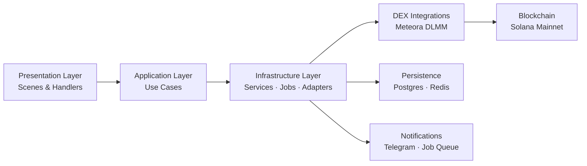

# Position Flows v2 Overview

## Purpose

This documentation set consolidates every position-related flow for the Meteora Liquidity Bot into a single, coherent reference. It supersedes the legacy documents in `docs/position/` and is aligned with the product expectations captured in `docs/PRD.md` and the architectural guardrails defined in `docs/SystemDesign.md`.

The goal is to make it trivial for engineers to understand how the create, claim-fees, rebalance, close, risk-management, and PnL calculation flows operate end-to-end across presentation, application, infrastructure, and persistence layers.

## Document Map

| Topic | Description | Location |
| --- | --- | --- |
| High-level create flow | User wizard → on-chain confirmation | [`create-position.md`](./create-position.md) |
| Manual/auto fee claiming | Claim + SOL conversion pipeline | [`claim-fees.md`](./claim-fees.md) |
| Manual & automated rebalancing | Close → convert → recreate cycle | [`rebalance.md`](./rebalance.md) |
| Closing positions | Full liquidation & PnL finalisation | [`close-position.md`](./close-position.md) |
| Risk controls | Stop-loss & take-profit design | [`risk-management.md`](./risk-management.md) |
| PnL & analytics | Segment, snapshot, and history model | [`pnl-calculation.md`](./pnl-calculation.md) |

## Architecture Alignment

All flows respect the layered architecture defined in the system design:

### Layer Responsibilities

- **Presentation (Telegraf scenes & handlers)** – orchestrate conversational UX, collect inputs, and route to use cases.
- **Application (Use cases)** – perform validation, compose adapter calls, enqueue background work, and coordinate persistence.
- **Infrastructure (Adapters, services, jobs)** – execute Solana/Jupiter interactions, manage pending transactions, parse confirmations, and fan-out notifications.
- **Persistence (Drizzle ORM / Postgres)** – store authoritative state for positions, segments, claim history, snapshots, and user preferences.

## Cross-Cutting Concerns

- **Job Queue Conventions** – `JOB_TX_CONFIRM` finalises on-chain actions, `JOB_POSITION_MONITOR` drives monitoring/auto-rebalance, `JOB_REBALANCE` encapsulates automated rebalance execution, and `JOB_NOTIFICATION` delivers Telegram updates.
- **Pending Transactions** – every user-initiated transaction is recorded in `pendingTransactions` with metadata required by the confirm worker; swaps triggered during auto-convert flows reuse the same pipeline.
- **Token Swaps** – `SwapService` wraps Jupiter orders to guarantee that fee proceeds and rebalance closures end in SOL. The conversion logic tolerates non-SOL tokens and provides fallbacks when conversions fail.
- **Caching** – portfolio and position-level cache keys (see `CachePatterns`) are invalidated after each successful confirmation to keep UI queries consistent with on-chain truth.
- **Notifications** – success paths enqueue contextual Telegram notifications (e.g., position created, fees claimed) to honour the PRD’s engagement requirements without blocking the main flow.
- **Risk Controls** – stop-loss/take-profit preferences are persisted today; enforcement hooks are planned in the position monitor (see [`risk-management.md`](./risk-management.md)).

## Key Modules Reference

| Layer | Module | Responsibility |
| --- | --- | --- |
| Presentation | `presentation/scenes/create-position.scene.ts` | Multi-step wizard and validation for creation |
|  | `presentation/scenes/position-detail.scene.ts` | Claim, rebalance, close actions & confirmations |
| Application | `application/position/*.use-case.ts` | Core business logic for each flow |
| Infrastructure | `infrastructure/jobs/workers/transaction-confirm.worker.ts` | Parses, persists, and notifies for on-chain confirmations |
|  | `infrastructure/jobs/workers/position-monitor.worker.ts` | Auto-monitoring and auto-rebalance triggers |
|  | `services/swap.service.ts` | Jupiter-backed token/SOL conversions |
| Persistence | `services/position-persistence.service.ts` | Initial position + snapshot creation |
|  | `services/claim-fees-persistence.service.ts` | Claim history & fee accounting |
|  | `services/rebalance-persistence.service.ts` | Segment rollover for rebalances |
|  | `services/close-position-persistence.service.ts` | Final close summaries & PnL computation |

## How to Use These Docs

1. Start with the specific flow document when updating or debugging a feature.
2. Cross-reference the data model in [`pnl-calculation.md`](./pnl-calculation.md) whenever persistence changes are required.
3. Review [`risk-management.md`](./risk-management.md) before extending stop-loss/take-profit or position monitoring logic.
4. Update the relevant v2 doc alongside code changes; the older documents in `docs/position/` can be deleted once this v2 set is adopted project-wide.

## Legacy Documents to Retire

The following files under `apps/bot/docs/position/` are superseded by the v2 set and can be removed after cross-team confirmation:

- `README.md`
- `implementation-summary.md`
- `position-creation-flow.md`
- `position-creation-implementation-strategy.md`
- `position-claim-fees-flow.md`
- `position-rebalance-flow.md`
- `rebalance-implementation-plan.md`
- `position-close-flow.md`
- `position-lifecycle-overview.md`
- `Position PnL Tracking Strategy.md`
- `tx-confirm-flow.md`
- `fee-claiming-sol-conversion.md`
- `fee-claiming-swap-implementation-summary.md`
- `sol-auto-convert-implementation.md`
- `position-detail-review.md`
- `position-helpers.ts`
- `position-lifecycle-example.ts`
- `schema.ts`

Any remaining notes in that folder should be migrated or merged into the v2 documents before deletion.
