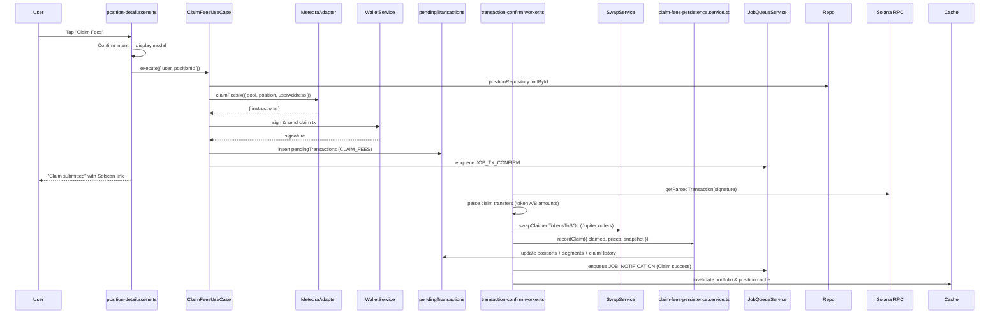

# Claim Fees Flow (v2)

## Overview

The claim fees flow lets users withdraw accrued DLMM fees from an active position. Claimed tokens are automatically converted to SOL to satisfy the PRD requirement for simplified custody. This document captures the conversational steps, backend orchestration, and persistence.

## High-Level Sequence

## Layer Responsibilities

| Layer | File(s) | Responsibilities |
| --- | --- | --- |
| Presentation | `presentation/scenes/position-detail.scene.ts` | Confirmation dialog, execution trigger, success copy |
| Application | `application/position/claim-fees.use-case.ts` | Validation, adapter invocation, transaction submission, pending tx metadata |
| Infrastructure | `services/swap.service.ts` | Jupiter-backed swaps to SOL |
| Worker | `transaction-confirm.worker.ts` | Instruction parsing, price lookups, swap execution, persistence and notifications |
| Persistence | `services/claim-fees-persistence.service.ts` | Claim history row, position fee totals, snapshots |
| Data | `db/schema.ts` | `claimHistory`, `positions`, `positionSnapshots` |

## Presentation Strategy

1. **Action** – The position detail scene exposes a "Claim Fees" button when status is `ACTIVE`.
2. **Confirm Dialog** – Displays a markdown confirmation emphasising automatic SOL conversion and the irreversible nature of the action.
3. **Execution** – On approval, the scene calls `ClaimFeesUseCase` and replies with a loading message until the use case resolves.
4. **User Feedback** – The scene updates the message with success/failure copy and prompts a refresh of the main position message.

## Application Strategy

`ClaimFeesUseCase.execute` performs:

1. **Validation** – Verifies user wallet, position ownership, and adapter availability.
2. **Adapter Call** – Invokes `IDexAdapter.claimFeesIx` to obtain Meteora claim instructions.
3. **Submission** – Sends the transaction via Sanctum Gateway or Jito fallback.
4. **Pending Transaction** – Inserts a record with `operationType = CLAIM_FEES` and a `ClaimFeesContext` (position metadata, estimated USD amount, token definitions).
5. **Job Scheduling** – Enqueues `JOB_TX_CONFIRM` for post-confirmation handling.

## Confirmation & Persistence Strategy

Within the transaction-confirm worker:

1. **Parsing** – `parseMeteoraInstructions` aggregates all token transfers from claim instructions to derive `claimedFeesTokenA/B`.
2. **Pricing** – `TokenPriceService` fetches USD prices for token A, token B, and SOL to support reporting.
3. **Conversion to SOL** – `swapClaimedTokensToSOL` executes Jupiter orders for each non-SOL token. If the swap succeeds, the USD value is recalculated using actual SOL received; otherwise the estimated USD value is retained.
4. **Snapshot Inputs** – If pool data remains accessible, the worker fetches the on-chain position via the adapter to populate a snapshot (current holdings, residual unclaimed fees).
5. **Persistence** – `claimFeesPersistenceService.recordClaim` runs a DB transaction that:
   - Inserts `claimHistory` row (type `manual` by default).
   - Updates `positions.totalFeesClaimedUSD` and the latest segment’s `feesClaimedUSD`.
   - Inserts a `positionSnapshots` record documenting post-claim state and recalculated total PnL.
6. **Cache Invalidation** – Portfolio and position caches are invalidated to keep the UI consistent.
7. **Notification** – A `JOB_NOTIFICATION` entry is queued summarising the claim (approximate USD and SOL amounts).

## Error Handling

- **Missing Instructions** – If the worker cannot parse claim transfers, it logs an error and skips persistence to avoid corrupt data.
- **Swap Failures** – Swap errors are logged; the flow continues using the estimated USD amount to preserve continuity.
- **Ownership Conflicts** – The use case returns an "Unauthorized" error when the position does not belong to the caller.
- **Retries** – Job retries handle transient RPC or price service errors.

## Extensibility Notes

- **Configurable Conversion** – `convertToSol` is currently hard-coded to true. Once wallet preferences support other payout tokens, the worker can branch accordingly.
- **Partial Claims & Thresholds** – The persistence service records amounts per claim, enabling future thresholds (e.g., auto-claim at ≥$10).
- **Metrics** – Claim success/failure logs can power a success-rate dashboard to track the PRD’s "zero lost funds" requirement.
