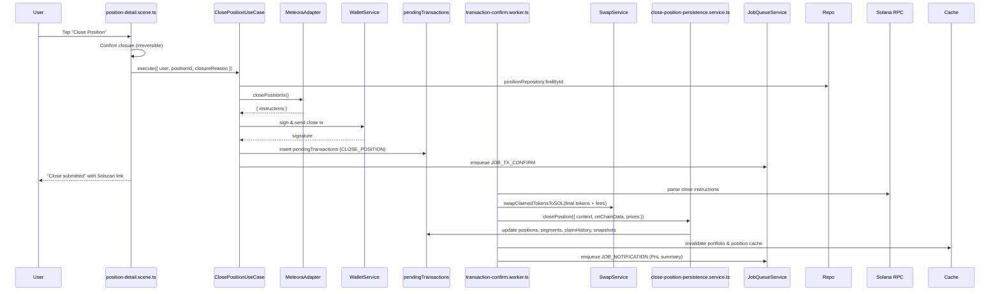

# Close Position Flow (v2)

## Overview

Closing a position permanently withdraws liquidity, claims remaining fees, converts proceeds to SOL, and reports the final Profit & Loss (PnL). This flow is critical for the PRD’s requirement to surface accurate closure summaries and prevent residual liquidity.

## High-Level Sequence

## Layer Responsibilities

| Layer | File(s) | Responsibilities |
| --- | --- | --- |
| Presentation | `presentation/scenes/position-detail.scene.ts` | Confirmation dialog, execution trigger, user messaging |
| Application | `application/position/close-position.use-case.ts` | Validation, adapter invocation, pending tx metadata |
| Worker | `transaction-confirm.worker.ts` | Instruction parsing, SOL conversions, persistence, notifications |
| Infrastructure | `services/swap.service.ts` | Token → SOL conversions |
| Persistence | `services/close-position-persistence.service.ts` | Final value & PnL computation, snapshots |
| Data | `db/schema.ts` | `positions`, `positionSegments`, `claimHistory`, `positionSnapshots` |

## Presentation Strategy

1. **Confirmation** – The scene stresses irreversibility and requires explicit confirmation.
2. **Execution** – On approval, the use case is invoked and the user sees a loading state until completion.
3. **Post-Submission UX** – The chat message is replaced with success copy and the main position message is refreshed to show status `CLOSED`.

## Application Strategy

`ClosePositionUseCase.execute` provides:

1. **Validation** – Confirms ownership, wallet connectivity, and adapter availability.
2. **Adapter Call** – `IDexAdapter.closePositionIx` builds the required remove + claim instructions.
3. **Transaction Submission** – Submits via Sanctum Gateway (preferred) or Jito fallback.
4. **Pending Metadata** – Records `PositionClosureContext` with token metadata, pool address, and closure reason (`user_close`, `stop_loss`, or `take_profit`).
5. **Optimistic Update** – Marks the domain entity status as `CLOSED` to reflect intent immediately.
6. **Job Scheduling** – Enqueues `JOB_TX_CONFIRM` for post-confirmation handling.

## Confirmation & Persistence Strategy

Within `transaction-confirm.worker.ts`:

1. **Instruction Parsing** – `extractCloseInstructionData` aggregates remove and claim transfers, outputting final token amounts and fee amounts in UI units and lamports.
2. **Price Fetching** – USD prices for token A, token B, and SOL enable accurate reporting.
3. **SOL Conversion** – Both final liquidity and fees are passed through `swapClaimedTokensToSOL`, ensuring the user ends with SOL. Conversion failures raise errors and trigger job retries.
4. **Persistence** – `closePositionPersistenceService.closePosition` performs a DB transaction that:
   - Inserts `claimHistory` (type `closure`) if fees were harvested.
   - Updates the current segment with realised PnL and marks it closed.
   - Updates the `positions` row with final USD/SOL values, final token amounts, and cumulative totals.
   - Creates a `positionSnapshots` record (`snapshotType = "closure"`) capturing final metrics.
5. **Cache & Notifications** – Portfolio and position caches are invalidated, and a multi-part notification summarises PnL and linking to Solscan is enqueued.

## PnL Calculation Summary

Inside the persistence service:

- **Segment PnL** = `(finalValueUSD + feesClaimedUSD) - segmentInitialUSD`
- **Total Realised PnL** accumulates prior segments + the current segment PnL.
- **Total PnL Percentage** = `(positionValueGain + totalFeesClaimedUSD) / initialValueUSD`
- **Final Value in SOL** is derived from the SOL price used during conversion for accurate wallet reconciliation.

Full formulas are detailed in [`pnl-calculation.md`](./pnl-calculation.md).

## Error Handling

- **Missing Position Address** – If parsing fails to recover the on-chain position, the flow logs and aborts to avoid corrupting state.
- **Swap Failures** – Logged and cause job retries; the transaction is marked failed only after retries are exhausted.
- **Cache Invalidation Failures** – Logged at `debug` and do not block completion (UI will refetch on next request).

## Extensibility Notes

- **Stop-Loss / Take-Profit Automation** – When triggered automatically, reuse the same use case with `closureReason` set accordingly. Persistence and notifications already accept the reason.
- **Summary Assets** – The notification payload reserves room for a visual summary; hooking into an image service only requires adding an additional notification message.
- **Multi-DEX** – Adapters for other DEXes must expose compatible `closePositionIx` semantics; the downstream pipeline is DEX-agnostic as long as `extractCloseInstructionData` can interpret the instructions.
