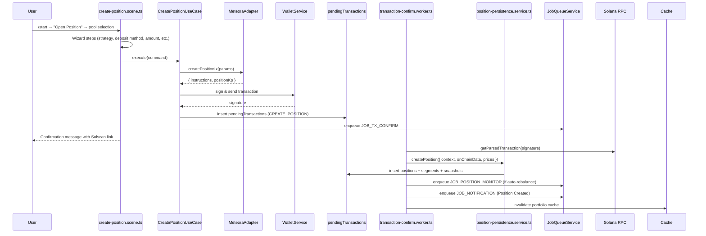

# Position Creation Flow (v2)

## Overview

The position creation flow guides a user from pool selection to an active Meteora DLMM position. It adheres to the conversational UX requirements in the PRD and respects the layered architecture in `SystemDesign.md`. This document captures both the high-level behaviour and the implementation strategy across all layers.

## High-Level Sequence

## Layer Responsibilities & Key Modules

| Layer | File(s) | Responsibilities |
| --- | --- | --- |
| Presentation | `presentation/scenes/create-position.scene.ts` | Multi-step wizard, validation, state management, progress updates |
| Application | `application/position/create-position.use-case.ts` | Validation, adapter orchestration, transaction submission, pending-tx metadata |
| Infrastructure | `types/dex-adapter.interface.ts`, `services/dex-registry.service.ts`, `adapters/meteora` | DEX abstraction and Meteora DLMM integration |
|  | `services/wallet.service.ts` | Privy/Jito gateway submission |
|  | `infrastructure/jobs/job-queue.service.ts` | Confirm + monitor job scheduling |
| Worker | `infrastructure/jobs/workers/transaction-confirm.worker.ts` | Confirmation parsing, persistence, notifications |
| Persistence | `services/position-persistence.service.ts` | Positions, segments, snapshots creation |
| Data | `db/schema.ts` | Tables: `positions`, `positionSegments`, `pendingTransactions`, `positionSnapshots` |

## Presentation Layer Strategy

1. **Scene Entry** – The wizard requires `poolAddress` and `dex` in the scene state. It fetches `UnifiedPool` data via `GetPoolDetailsUseCase` and renders strategy options.
2. **Wizard Steps** – The flow currently supports balanced (SOL auto-convert) paths. The single-sided branch exists but is feature-flagged for future work.
   - Strategy selection (`strategy:spot|curve|bid-ask`)
   - Deposit method (Balanced vs Single-sided)
   - Optional token/deposit source selection
   - Amount capture with canned buttons and custom input (validated against SOL balance via `GetBalanceUseCase`)
   - Auto-rebalance toggle (default on)
   - Summary step uses `CalculateBalancedDistributionUseCase` and `GetPriceRangeUseCase`
3. **Confirmation** – On approval, the scene calls the use case and updates the message with a non-blocking success state.
4. **Error Handling** – Any validation failure replies with actionable errors and either repeats the step or terminates the scene safely.

## Application Layer Strategy

`CreatePositionUseCase.execute` performs the following:

1. **Validation** – Ensures wallet context, pool address validity, and non-zero token amounts.
2. **Adapter Call** – Invokes `IDexAdapter.createPositionIx` with raw token amounts (converted by `uiToRawAmount`).
3. **Transaction Submission** – Uses `WalletService` to sign and send through Sanctum Gateway when available, falling back to the Jito path.
4. **Pending Transaction Record** – Persists metadata in `pendingTransactions` with `operationType = CREATE_POSITION`. Metadata includes the full `PositionCreationContext` so the worker can reconstruct intent.
5. **Job Scheduling** – Enqueues `JOB_TX_CONFIRM` (delayed 500 ms). Portfolio caches are invalidated optimistically.
6. **Future Extension** – `handleSolAutoConvert` is scaffolded to support SOL→token swaps. The wizard still collects amount data in SOL, so enabling this path will not require UX changes.

## Confirmation & Persistence Strategy

The transaction confirm worker finalises the flow:

1. **Transaction Parsing** – `parseMeteoraInstructions` extracts open/add instructions and token transfer amounts to determine actual token deposits.
2. **Price Fetching** – Pulls USD prices for token A, token B, and SOL via `TokenPriceService`, satisfying the PRD requirement for accurate USD reporting.
3. **Persistence** – `positionPersistenceService.createPosition` executes a transaction that:
   - Inserts into `positions` with initial USD/SOL values, token amounts, strategy metadata, and bin range.
   - Creates `positionSegments` row (segment #1) and a corresponding `positionSnapshots` entry.
4. **Monitoring** – If `autoRebalance` is true, enqueues `JOB_POSITION_MONITOR` with a repeat interval (currently 30 s placeholder; production aligns with user settings).
5. **Notification** – Sends a general notification summarising success and advising the user to check the portfolio.
6. **Cache Invalidation** – `CachePatterns.portfolioPattern(userId)` is cleared to refresh UI reads.

## Error Handling & Observability

- **Timeouts** – The worker marks pending transactions as failed after five minutes without confirmation.
- **Retries** – The job queue uses exponential backoff via BullMQ defaults; errors thrown from the worker will be retried automatically.
- **Logging** – `logger.info/error` statements exist for each nuanced failure (adapter failure, wallet submission failure, DB insert failure).
- **Metrics Alignment** – The flow instrumentation ties into the PRD success metrics (≥95 % creation success) by logging result status and providing raw data for dashboards.

## Extensibility Notes

- **Single-Sided Deposits** – Scene scaffolding exists. Enabling this requires implementing the deposit source branch and completing `handleSolAutoConvert`.
- **DEX-Agnostic Support** – The use case defers to `dexRegistry.get(dex)` so other DEXes can hook into the same flow once adapters are registered.
- **Advanced Stages** – Stop-loss/take-profit inputs can be collected post-summary; the context already includes `slPercentage`/`tpPercentage` fields.
- **UX Enhancements** – Progress copy is centralised in `generateProgressMessage` to stay consistent with messaging standards described in the PRD.

## Checklist for Future Changes

- Update both this doc and the scene/use case comments when new steps are added.
- Confirm that pending transaction metadata always contains enough context for the worker to recover from restarts.
- Keep the wizard under Telegram’s 64-button limit and ensure every callback query is answered to satisfy Telegram API rules.
