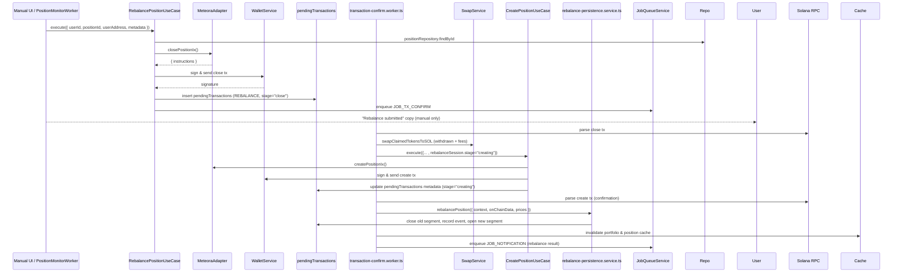

# Rebalance Flow (v2)

## Overview

Rebalancing realigns a position’s liquidity distribution when the active price exits the configured range. The flow supports both manual triggers from the user interface and automated triggers from `JOB_POSITION_MONITOR`, aligning with the PRD requirement for automation. Technically, a rebalance is a coordinated close → convert → recreate sequence captured in the metadata of a `RebalanceSession`.

## High-Level Sequence

## Key Concepts

- **RebalanceSessionMetadata** – Stored in `pendingTransactions.metadata`. Tracks the rebalance lifecycle (`stage: "close" | "creating"`), token conversions, and references to old/new position addresses.
- **Two-Phase Confirmation** – The confirm worker processes the close signature first, triggers a new create transaction, then finalises once the create transaction confirms.
- **SOL as Settlement** – All withdrawn liquidity plus claimed fees are converted to SOL before purchasing fresh token balances, ensuring deterministic capital for recreation.

## Triggers

1. **Manual** – `position-detail.scene.ts` exposes a "Rebalance" button for active positions. Confirmation routes to `RebalancePositionUseCase` with `metadata.trigger = "manual"`.
2. **Automatic** – `PositionMonitorWorker` polls on-chain data via `GetPositionUseCase`. When a position is out of range and auto-rebalance is enabled, it enqueues `JOB_REBALANCE` with `reason = "out_of_range_auto"`.
3. **Other** – Future triggers (e.g., stop-loss/take-profit) should enqueue the same job with an appropriate `reason` value.

## Application Layer Strategy

`RebalancePositionUseCase.execute` (manual path):

1. Validates ownership, wallet data, and adapter availability.
2. Calls `IDexAdapter.closePositionIx` to build the close transaction.
3. Submits the transaction via `WalletService`.
4. Persists a pending record with metadata:
   - `command` (position identifiers)
   - `rebalanceSession` (token info, strategy, thresholds, trigger reason)
5. Optimistically marks the domain position as `REBALANCING`.
6. Enqueues `JOB_TX_CONFIRM` for the close signature.
7. Invalidates relevant caches.

Automated jobs reuse the same use case but pass the wallet address captured in the monitoring payload.

## Confirmation Worker Responsibilities

### Stage 1: Closing the Existing Position

- Parses Meteora remove/claim instructions to quantify tokens withdrawn and fees harvested (`extractCloseInstructionData`).
- Converts *all* tokens to SOL via `swapClaimedTokensToSOL` so the recreation stage starts with SOL budget.
- Splits usable SOL equally for token A and token B purchases (after reserving `MINIMAL_SOL_AMOUNT_IN_LAMPORTS`).
- Executes SOL→token swaps via `SwapService` (handles native SOL edge cases).
- Calls `CreatePositionUseCase.execute` with `rebalanceSession.stage = "creating"` and the rehydrated token amounts. This yields a second signature and updates the pending transaction metadata with conversion details.

### Stage 2: Finalising the New Position

- When the create signature confirms, the worker calls `rebalancePersistenceService.rebalancePosition`:
  - Closes the previous segment (`positionSegments`) and records realised PnL plus fees collected during rebalance.
  - Inserts a new segment with the recreated position’s initial value.
  - Stores a `rebalanceEvents` row capturing conversion details.
  - Updates the main `positions` row (new address, segment number, totals).
  - Inserts a snapshot documenting the new baseline.
- Invalidates portfolio and position caches.
- Sends a rebalance notification describing the trigger and net effect.

## Error Handling

- **No Liquidity Recovered** – If SOL conversions fail or net SOL is below the minimum, the worker throws, leaving the original pending tx as failed. Manual intervention is required.
- **Swap Failures** – Each swap failure raises an error; the job retry attempts cover transient Jupiter issues.
- **Dual Signature Tracking** – Metadata must always include both close and create signatures. The worker updates pending metadata to preserve continuity across restarts.

## Extensibility Notes

- **Partial Rebalance Strategies** – The session metadata already captures conversion ratios. Introducing custom split logic only requires adjusting the SOL allocation before SOL→token swaps.
- **Multi-DEX Support** – The session stores `dex` and token metadata, enabling reuse once additional adapters implement `closePositionIx` and `createPositionIx`.
- **Metrics** – Record durations between close and create confirmations to monitor adherence to the PRD’s <10 s position management target.
- **Manual Overrides** – Additional UI affordances (e.g., selecting target bin ranges during rebalance) can be passed through `metadata` and interpreted during recreation.
