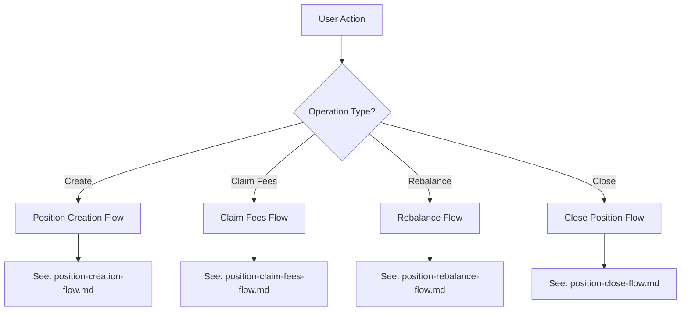

# Position Flows Documentation

## Overview

This directory contains comprehensive documentation for all position-related flows in the Meteora Liquidity Bot. Each flow document provides detailed implementation guidance strictly following the current system design and existing code architecture.

## Document Structure

### Core Flow Documents

1. **[Position Creation Flow](./position-creation-flow.md)**
   - Complete wizard-based position creation
   - From pool selection through transaction confirmation
   - Covers SOL auto-convert and single-sided strategies
   - **NEW**: Includes Stop Loss & Take Profit configuration

2. **[Position Claim Fees Flow](./position-claim-fees-flow.md)**
   - Manual fee claiming with automatic SOL conversion
   - Transaction parsing and database persistence
   - Error handling and user notifications

3. **[Position Rebalance Flow](./position-rebalance-flow.md)**
   - Manual and automatic position rebalancing
   - Coordinated close and recreate transactions
   - Session management and segment tracking
   - **NEW**: Enhanced to handle Stop Loss & Take Profit triggers

4. **[Position Close Flow](./position-close-flow.md)**
   - Complete position liquidation
   - SOL conversion of all tokens
   - Final PnL calculation and reporting

5. **[Position Lifecycle Overview](./position-lifecycle-overview.md)**
   - High-level view of all position states
   - State transitions and data relationships
   - System architecture and integration patterns

6. **[Stop Loss & Take Profit Implementation](./position-stop-loss-take-profit-implementation.md)**
   - **NEW**: Technical implementation details for SL/TP features
   - Database schema, monitoring logic, and integration points

7. **[Stop Loss & Take Profit Flow](./position-stop-loss-take-profit-flow.md)**
   - **NEW**: Detailed flow diagrams and sequence charts
   - Component interactions and data flow visualization

8. **[Stop Loss & Take Profit User Guide](./position-stop-loss-take-profit-user-guide.md)**
   - **NEW**: Comprehensive user guide for SL/TP features
   - Setup instructions, examples, and best practices

### Supporting Documents

6. **[Implementation Summary](./implementation-summary.md)**
   - Summary of transaction confirmation enhancements
   - Parser-based approach vs on-chain fetching
   - Performance improvements

7. **[Transaction Confirmation Flow](./tx-confirm-flow.md)**
   - Detailed worker processing logic
   - Job queue management
   - Error handling strategies

8. **[Rebalance Implementation Plan](./rebalance-implementation-plan.md)**
   - Technical rebalancing implementation details
   - Transaction coordination strategies
   - SOL conversion handling

## Quick Reference

### Flow Decision Tree



### Architecture Alignment

All flows strictly follow the established system architecture:

```
Presentation Layer (Scenes)
    ↓
Application Layer (Use Cases)
    ↓
Infrastructure Layer (Services, Workers, Queue)
    ↓
DEX Layer (Adapters)
    ↓
Blockchain Layer (Solana, Jupiter)
    ↓
Data Layer (Database, Cache)
```

### Implementation Status

| Flow | Status | Key Components | Documentation |
|-------|--------|----------------|-------------|
| Position Creation | ✅ Implemented | position-creation-flow.md |
| Claim Fees | ✅ Implemented | position-claim-fees-flow.md |
| Rebalance | ✅ Implemented | position-rebalance-flow.md |
| Close Position | ✅ Implemented | position-close-flow.md |
| Transaction Confirmation | ✅ Implemented | tx-confirm-flow.md |
| Monitoring | ✅ Implemented | position-lifecycle-overview.md |
| Stop Loss & Take Profit | ✅ **NEWLY IMPLEMENTED** | position-stop-loss-take-profit-implementation.md |
| SL/TP Flow | ✅ **NEWLY DOCUMENTED** | position-stop-loss-take-profit-flow.md |
| SL/TP User Guide | ✅ **NEWLY CREATED** | position-stop-loss-take-profit-user-guide.md |

### Common Patterns

All position flows share these common implementation patterns:

1. **Wizard-Based User Interaction**
   - Multi-step scenes with state management
   - Progress indicators and confirmation dialogs
   - Back navigation and error recovery

2. **Transaction Orchestration**
   - Use case → DEX adapter → Privy signing
   - Pending transaction storage
   - Background job processing

3. **Parser-Based Confirmation**
   - Transaction instruction parsing instead of on-chain fetching
   - Immediate data availability
   - Reduced RPC dependency

4. **Automatic SOL Conversion**
   - Jupiter API integration for token swaps
   - Unified SOL handling for fees and closures
   - Fallback to price-based estimation

5. **Segment-Based Tracking**
   - Position segments for rebalancing history
   - PnL calculation per segment
   - Lifecycle state management

6. **Cache-Invalidation Strategy**
   - Portfolio cache invalidation on position changes
   - Position-specific cache management
   - Automatic refresh on user access

## Development Guidelines

### When Implementing Changes

1. **Follow Existing Patterns**
   - Use established use case patterns
   - Maintain transaction coordination
   - Preserve data consistency

2. **Update Documentation**
   - Keep flow documents synchronized with code
   - Update sequence diagrams for changes
   - Document new error conditions

3. **Test Integration**
   - Unit tests for use cases
   - Integration tests for worker processing
   - End-to-end flow testing

4. **Monitor Performance**
   - Track success rates and timing
   - Monitor error patterns
   - Optimize based on metrics

### Code Organization

```
apps/bot/src/
├── presentation/scenes/          # User interaction flows
├── application/position/          # Business logic
├── infrastructure/jobs/workers/  # Background processing
├── services/                     # Shared services
├── adapters/dex/                 # DEX integrations
└── db/schema.ts                  # Data models
```

## Support

For questions about position flows:
1. Review the specific flow document
2. Check the lifecycle overview for context
3. Reference implementation summary for technical details
4. Consult system design documentation for architectural decisions

All documentation is maintained to reflect the current implementation and provide clear guidance for future development and maintenance.