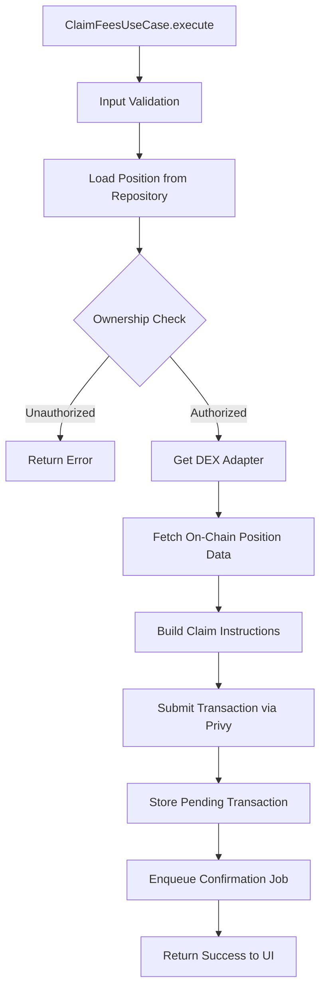
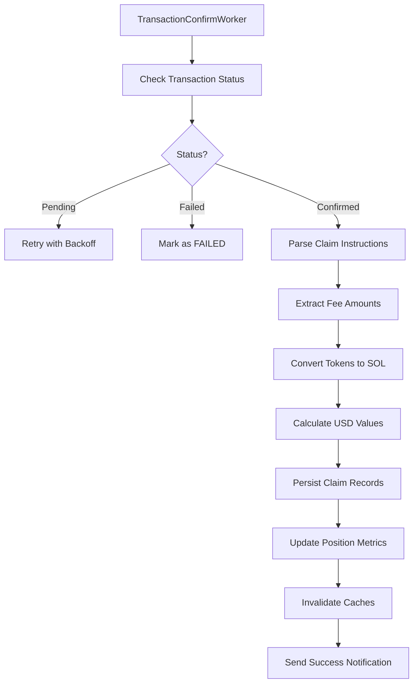
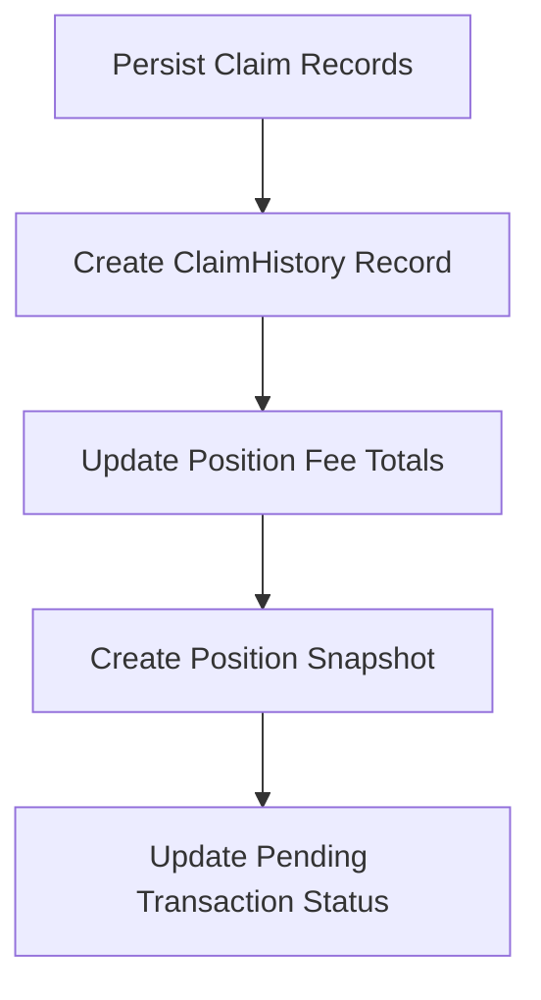

# Position Claim Fees Flow Documentation

## Overview

This document describes the complete fee claiming flow for Meteora DLMM positions, from user initiation through transaction confirmation and SOL conversion. The flow follows system design architecture: Presentation → Application → Infrastructure → DEX Adapter → Blockchain → Worker → Database.

## Architecture Components

### Core Components

1. **Presentation Layer**
   - `position-detail.scene.ts` - Position detail view with claim fees action
   - Handles user confirmation and progress feedback

2. **Application Layer**
   - `claim-fees.use-case.ts` - Business logic orchestration
   - Validates ownership and prepares claim transaction

3. **Infrastructure Layer**
   - `transaction-confirm.worker.ts` - Background transaction processing
   - `swap.service.ts` - Token-to-SOL conversion via Jupiter
   - `claim-fees-persistence.service.ts` - Database operations

4. **DEX Layer**
   - `meteora.adapter.ts` - Meteora DLMM fee claiming integration
   - Implements `IDexAdapter.claimFeesIx()` method

5. **Data Layer**
   - `positions` table - Updates fee tracking fields
   - `claimHistory` table - Records of all fee claims
   - `positionSnapshots` table - State snapshots after claims

## Complete Flow Sequence

### Phase 1: User Initiation

```mermaid
flowchart TD
    A[User views Position Detail] --> B[Clicks "Claim Fees"]
    B --> C[Load Position Data]
    C --> D{Position Has Fees?}
    D -- No --> E[Show "No Fees Available" Message]
    D -- Yes --> F[Display Claim Confirmation]
    F --> G{User Confirms?}
    G -- No --> H[Return to Position Detail]
    G -- Yes --> I[Show Loading Message]
```

**Implementation Details:**
- Scene loads position via `GetPositionUseCase`
- Checks `unclaimedFeesUsd > 0` from position data
- Shows confirmation dialog with estimated fee amounts
- Displays "💸 Claim Fees" confirmation keyboard

### Phase 2: Transaction Orchestration



**ClaimFeesUseCase Implementation:**

1. **Input Validation**
   ```typescript
   if (!command?.user) return { success: false, error: "User required" };
   if (!command?.positionId) return { success: false, error: "Position ID required" };
   if (!user?.walletAddress) return { success: false, error: "Wallet required" };
   ```

2. **Position Loading & Validation**
   ```typescript
   const position = await this.positionRepository.findById(command.positionId);
   if (!position) return { success: false, error: "Position not found" };
   if (position.userId !== command.user.id) {
     return { success: false, error: "Unauthorized" };
   }
   ```

3. **On-Chain Data Fetch**
   ```typescript
   const adapter = this.dexRegistry.get(position.dex);
   const onchain = await adapter.getPosition(position.positionAddress, {
     userAddress: user.walletAddress,
     poolAddress: position.poolAddress,
   });
   const estimatedUnclaimedFeesUsd = Number(onchain.unclaimedFeesUsd || 0);
   ```

4. **Transaction Building**
   ```typescript
   const txResult = await adapter.claimFeesIx({
     poolAddress: position.poolAddress,
     userAddress: user.walletAddress,
     positionAddress: position.positionAddress,
   });
   ```

5. **Pending Transaction Storage**
   ```typescript
   await db.insert(pendingTransactions).values({
     signature: txResult.signature,
     operationType: "CLAIM_FEES",
     userId: command.user.id,
     status: "PENDING",
     metadata: JSON.stringify({
       claimContext: {
         userId: command.user.id,
         positionId: command.positionId,
         positionAddress: position.positionAddress,
         poolAddress: position.poolAddress,
         userAddress: user.walletAddress,
         tokenA: position.tokenX,
         tokenB: position.tokenY,
         convertToSol: true, // Always convert to SOL
         estimatedFeesUsd,
       }
     }),
   });
   ```

6. **Job Enqueue**
   ```typescript
   await jobQueue.enqueue(JOB_TX_CONFIRM, {
     signature: txResult.signature,
     operationType: "CLAIM_FEES",
     userId: command.user.id,
     positionId: command.positionId,
     positionAddress: position.positionAddress,
   });
   ```

### Phase 3: Transaction Confirmation & Processing



**Worker Processing Steps:**

1. **Transaction Status Monitoring**
   ```typescript
   const status = await this.solana.getSignatureStatus(signature);
   if (!status.confirmationStatus && !status.err) {
     // Retry with exponential backoff
     throw new Error("Transaction pending");
   }
   ```

2. **Transaction Parsing**
   ```typescript
   const parsedTx = await connection.getParsedTransaction(signature);
   const instructions = parseMeteoraInstructions(parsedTx);
   const claimInstructions = instructions.filter(ix => ix.instructionType === "claim");
   
   // Aggregate token transfers from all claim instructions
   const aggregateTransfers = new Map<string, number>();
   for (const instruction of claimInstructions) {
     for (const transfer of instruction.tokenTransfers ?? []) {
       const current = aggregateTransfers.get(transfer.mint) ?? 0;
       aggregateTransfers.set(transfer.mint, current + transfer.amount);
     }
   }
   ```

3. **Fee Amount Extraction**
   ```typescript
   const rawAmountA = aggregateTransfers.get(tokenAMint) || 0;
   const rawAmountB = aggregateTransfers.get(tokenBMint) || 0;
   
   const tokenAUi = decimalFromRaw(rawAmountA, tokenADecimals);
   const tokenBUi = decimalFromRaw(rawAmountB, tokenBDecimals);
   ```

4. **SOL Conversion (Automatic)**
   ```typescript
   let solReceived = new Decimal(0);
   const priceData = await this.priceService.getPrices([tokenAMint, tokenBMint, solMint]);
   
   // Direct SOL proceeds (if any fees are in SOL)
   if (tokenAMint === solMint) {
     solReceived = solReceived.add(lamportsToSol(rawAmountA));
   }
   if (tokenBMint === solMint) {
     solReceived = solReceived.add(lamportsToSol(rawAmountB));
   }
   
   // Jupiter swaps for non-SOL fees
   if (convertToSol && user) {
     if (tokenAMint !== solMint) {
       solReceived = solReceived.add(
         await this.swapService.swapTokenToSol(user, tokenAMint, rawAmountA)
       );
     }
     if (tokenBMint !== solMint) {
       solReceived = solReceived.add(
         await this.swapService.swapTokenToSol(user, tokenBMint, rawAmountB)
       );
     }
   }
   ```

5. **USD Value Calculation**
   ```typescript
   const estimatedUsd = tokenAUi.mul(priceData[tokenAMint]?.price ?? 0)
     .add(tokenBUi.mul(priceData[tokenBMint]?.price ?? 0));
     
   const claimedUsd = solReceived.gt(0) && (priceData[solMint]?.price ?? 0) > 0
     ? solReceived.mul(priceData[solMint]!.price)
     : estimatedUsd;
   ```

### Phase 4: Database Persistence



**Database Operations:**

1. **Claim History Record**
   ```typescript
   await claimFeesPersistenceService.recordClaim({
     signature,
     context: { positionId, userId },
     claimed: {
       tokenXAmount: tokenAUi.toDecimalPlaces(tokenADecimals, Decimal.ROUND_DOWN).toString(),
       tokenYAmount: tokenBUi.toDecimalPlaces(tokenBDecimals, Decimal.ROUND_DOWN).toString(),
       claimedUsdValue: claimedUsd.toFixed(2),
       tokenXPriceUsd: priceData[tokenAMint]?.price ?? 0,
       tokenYPriceUsd: priceData[tokenBMint]?.price ?? 0,
       solReceived: solReceived.isZero() ? undefined : solReceived.toDecimalPlaces(9).toString(),
     },
     prices: { solUsd: priceData[solMint]?.price ?? 0 },
     claimType: "manual",
   });
   ```

2. **Position Updates**
   ```typescript
   // Update total fees claimed
   await db
     .update(positions)
     .set({ totalFeesClaimedUSD: sql`${positions.totalFeesClaimedUSD} + ${claimedUsd}` })
     .where(eq(positions.id, positionId));
   
   // Update current segment's claimed fees
   await positionPersistenceService.updateSegmentFeesClaimed(
     positionId,
     position.currentSegmentNumber,
     claimedUsd
   );
   ```

3. **Position Snapshot**
   ```typescript
   await positionPersistenceService.createSnapshot({
     positionId,
     type: "claim",
     tokenBalances: { /* post-claim balances */ },
     usdValues: { /* calculated USD values */ },
     prices: priceData,
   });
   ```

4. **Pending Transaction Update**
   ```typescript
   await db
     .update(pendingTransactions)
     .set({ 
       status: "COMPLETED",
       completedAt: new Date(),
     })
     .where(eq(pendingTransactions.signature, signature));
   ```

### Phase 5: Post-Claim Actions

1. **Cache Invalidation**
   ```typescript
   await this.cache.invalidate(CachePatterns.portfolioPattern(userId));
   await this.cache.invalidate(CachePatterns.positionPattern(positionId));
   ```

2. **Success Notification**
   ```typescript
   await jobQueue.enqueue(JOB_NOTIFICATION, {
     userId,
     notification: {
       type: "general",
       title: "Fees Claimed",
       message: `Claim confirmed: ~${claimedUsd.toFixed(2)} converted to ${solReceivedLabel}.`,
     },
   });
   ```

3. **UI Update**
   - Refresh position detail view with updated fee amounts
   - Show success message with transaction link
   - Update portfolio view if affected

## Error Handling

### User-Level Errors
- **No Fees Available**: Clear message with explanation
- **Position Not Found**: Validate position exists and belongs to user
- **Unauthorized Access**: Check position ownership before allowing claim

### Transaction-Level Errors
- **Signature Rejection**: User cancelled - allow retry
- **RPC Timeout**: Automatic retry with exponential backoff
- **Slippage Issues**: Not applicable for fee claims (fixed amounts)

### Worker-Level Errors
- **Transaction Parsing Failure**: Log and retry with exponential backoff
- **Swap Service Failure**: Fall back to price-based USD estimation
- **Database Persistence Failure**: Critical error - alert for manual intervention

### Swap Service Integration
The fee claim flow automatically converts all claimed fees to SOL:

1. **Jupiter Integration**
   - Fetch best route for token → SOL
   - Build swap transaction
   - Execute via user's Privy wallet
   - Handle slippage and retries

2. **Fallback Logic**
   - If swap fails, use price-based USD valuation
   - Log swap failure for monitoring
   - Continue with claim completion

3. **Error Handling**
   - Insufficient liquidity for swap
   - High slippage warnings
   - Transaction timeout and retries

## Data Models

### ClaimFeesContext
Context stored in pending transaction metadata:
```typescript
interface ClaimFeesContext {
  userId: string;
  positionId: string;
  positionAddress: string;
  poolAddress: string;
  userAddress: string;
  tokenA: Token;
  tokenB: Token;
  convertToSol: boolean; // Always true for current implementation
  estimatedFeesUsd?: number;
}
```

### Claim Record Data
Structure stored in `claimHistory` table:
```typescript
interface ClaimRecord {
  positionId: string;
  signature: string;
  claimType: "manual" | "rebalance" | "closure";
  
  // Claimed amounts
  tokenXAmount: string;
  tokenYAmount: string;
  claimedUsdValue: string;
  solReceived?: string;
  
  // Price context
  tokenXPriceUsd: number;
  tokenYPriceUsd: number;
  solUsd: number;
  
  // Timestamps
  createdAt: Date;
}
```

## Integration Points

### Entry Points
- Position detail scene "💸 Claim Fees" button
- Auto-claim during position rebalancing
- Auto-claim during position closure

### Exit Points
Successful claim exits to:
- Updated position detail view
- Portfolio view with updated fee totals
- Success notification with transaction link

Failed claim exits to:
- Position detail view with error message
- Retry option for transient failures
- Support contact for persistent issues

## Performance Considerations

### Optimization Points
1. **Fee Estimation Caching**: Cache unclaimed fees for 2-minute TTL
2. **Price Data Batching**: Fetch all prices in single API call
3. **Swap Route Optimization**: Use Jupiter API for best rates
4. **Async Operations**: Parallel processing where possible

### Monitoring Metrics
- Claim success rate
- Average SOL conversion rates
- Swap failure rates
- User claim frequency patterns
- Fee claim processing time

This flow ensures users can easily claim their accumulated fees with automatic SOL conversion, providing a seamless experience with proper error handling and clear feedback throughout the process.