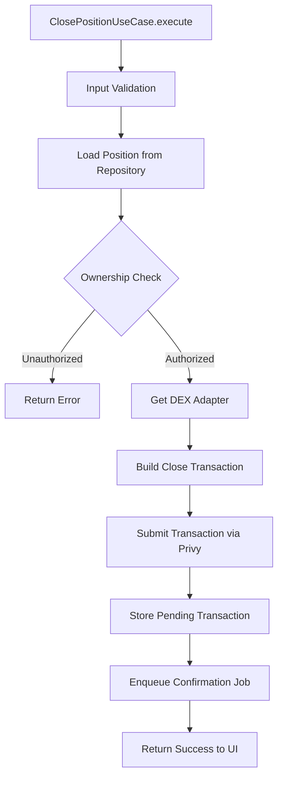
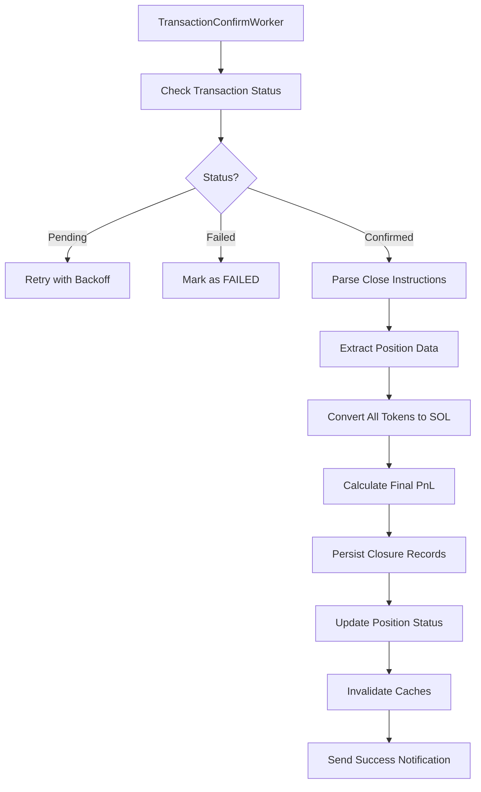
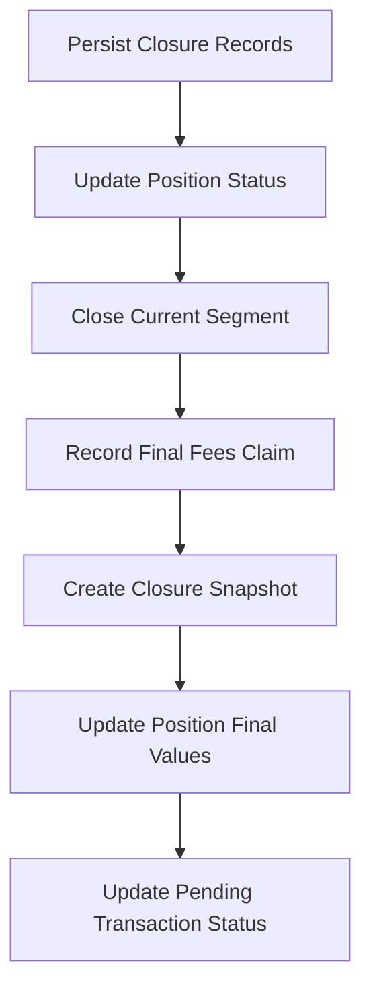

# Position Close Flow Documentation

## Overview

This document describes the complete position closure flow for Meteora DLMM positions, from user initiation through transaction confirmation, SOL conversion, and PnL calculation. The flow follows system design architecture: Presentation → Application → Infrastructure → DEX Adapter → Blockchain → Worker → Database.

## Architecture Components

### Core Components

1. **Presentation Layer**
   - `position-detail.scene.ts` - Position detail view with close position action
   - Handles user confirmation and progress feedback

2. **Application Layer**
   - `close-position.use-case.ts` - Business logic orchestration
   - Validates ownership and prepares close transaction

3. **Infrastructure Layer**
   - `transaction-confirm.worker.ts` - Background transaction processing
   - `swap.service.ts` - Token-to-SOL conversion via Jupiter
   - `close-position-persistence.service.ts` - Database operations

4. **DEX Layer**
   - `meteora.adapter.ts` - Meteora DLMM position closing integration
   - Implements `IDexAdapter.closePositionIx()` method

5. **Data Layer**
   - `positions` table - Main position records with final values
   - `positionSegments` table - Segment lifecycle completion
   - `positionSnapshots` table - State snapshots at closure
   - `claimHistory` table - Final fee claim record

## Complete Flow Sequence

### Phase 1: User Initiation

```mermaid
flowchart TD
    A[User views Position Detail] --> B[Clicks "Close Position"]
    B --> C[Load Position Data]
    C --> D{Position Active?}
    D -- No --> E[Show "Position Already Closed" Message]
    D -- Yes --> F[Display Close Confirmation]
    F --> G{User Confirms?}
    G -- No --> H[Return to Position Detail]
    G -- Yes --> I[Show Loading Message]
```

**Implementation Details:**
- Scene loads position via `GetPositionUseCase`
- Validates position status is "ACTIVE"
- Shows confirmation dialog with PnL summary and final amounts
- Requires second confirmation: Type "CLOSE" to confirm
- Displays "❌ Close Position" confirmation keyboard

### Phase 2: Transaction Orchestration



**ClosePositionUseCase Implementation:**

1. **Input Validation**
   ```typescript
   if (!command?.user) return { success: false, error: "User required" };
   if (!command?.positionId) return { success: false, error: "Position ID required" };
   if (!command?.userAddress) return { success: false, error: "User address required" };
   ```

2. **Position Loading & Validation**
   ```typescript
   const position = await this.positionRepository.findById(command.positionId);
   if (!position) return { success: false, error: "Position not found" };
   if (position.userId !== command.user.id) {
     return { success: false, error: "Unauthorized" };
   }
   ```

3. **Transaction Building**
   ```typescript
   const adapter = this.dexRegistry.get(position.dex);
   const closeTx = await adapter.closePositionIx({
     userAddress: command.userAddress,
     poolAddress: position.poolAddress,
     positionAddress: position.positionAddress,
   });
   ```

4. **Pending Transaction Storage**
   ```typescript
   await db.insert(pendingTransactions).values({
     signature: closeResult.signature,
     operationType: "CLOSE_POSITION",
     userId: command.user.id,
     status: "PENDING",
     metadata: JSON.stringify({
       closureReason: command.closureReason || "user_close",
       positionContext: {
         userId: command.user.id,
         positionId: command.positionId,
         positionAddress: position.positionAddress,
         poolAddress: position.poolAddress,
         userAddress: command.userAddress,
         tokenA: position.tokenX,
         tokenB: position.tokenY,
       }
     }),
   });
   ```

5. **Job Enqueue**
   ```typescript
   await jobQueue.enqueue(JOB_TX_CONFIRM, {
     signature: closeResult.signature,
     operationType: "CLOSE_POSITION",
     userId: command.user.id,
     positionId: command.positionId,
     positionAddress: position.positionAddress,
   });
   ```

### Phase 3: Transaction Confirmation & Processing



**Worker Processing Steps:**

1. **Transaction Status Monitoring**
   ```typescript
   const status = await this.solana.getSignatureStatus(signature);
   if (!status.confirmationStatus && !status.err) {
     // Retry with exponential backoff
     throw new Error("Transaction pending");
   }
   ```

2. **Transaction Parsing**
   ```typescript
   const parsedTx = await connection.getParsedTransaction(signature);
   const instructions = parseMeteoraInstructions(parsedTx);
   
   // Find close and remove liquidity instructions
   const closeInstruction = instructions.find(ix => ix.instructionType === "close");
   const removeInstructions = instructions.filter(ix => ix.instructionType === "remove");
   ```

3. **Position Data Extraction**
   ```typescript
   // Extract final token amounts from remove instructions
   const aggregateTransfers = new Map<string, number>();
   for (const instruction of removeInstructions) {
     for (const transfer of instruction.tokenTransfers ?? []) {
       const current = aggregateTransfers.get(transfer.mint) ?? 0;
       aggregateTransfers.set(transfer.mint, current + transfer.amount);
     }
   }
   
   const finalTokenAAmount = aggregateTransfers.get(tokenAMint) || 0;
   const finalTokenBAmount = aggregateTransfers.get(tokenBMint) || 0;
   ```

4. **Complete SOL Conversion**
   ```typescript
   let solReceived = new Decimal(0);
   const priceData = await this.priceService.getPrices([tokenAMint, tokenBMint, solMint]);
   
   // Convert all withdrawn tokens to SOL
   if (tokenAMint !== solMint) {
     solReceived = solReceived.add(
       await this.swapService.swapTokenToSol(user, tokenAMint, finalTokenAAmount)
     );
   } else {
     solReceived = solReceived.add(lamportsToSol(finalTokenAAmount));
   }
   
   if (tokenBMint !== solMint) {
     solReceived = solReceived.add(
       await this.swapService.swapTokenToSol(user, tokenBMint, finalTokenBAmount)
     );
   } else {
     solReceived = solReceived.add(lamportsToSol(finalTokenBAmount));
   }
   ```

5. **Final PnL Calculation**
   ```typescript
   // Calculate USD values
   const finalValueUsd = solReceived.mul(priceData[solMint]?.price ?? 0);
   const initialValueUsd = Number(position.initialValueUSD);
   const totalFeesClaimedUsd = Number(position.totalFeesClaimedUSD);
   
   // Calculate PnL
   const totalPnlUsd = finalValueUsd - initialValueUsd;
   const totalPnlPercentage = (totalPnlUsd / initialValueUsd) * 100;
   
   // Include claimed fees in total returns
   const totalReturnUsd = finalValueUsd + totalFeesClaimedUsd;
   ```

### Phase 4: Database Persistence



**Database Operations:**

1. **Position Status Update**
   ```typescript
   await db
     .update(positions)
     .set({ 
       status: "CLOSED",
       closedAt: new Date(),
       closureSignature: signature,
       finalValueUSD: finalValueUsd,
       finalValueSOL: solReceived.toDecimalPlaces(9).toString(),
       finalTokenXAmount: finalTokenAAmountStr,
       finalTokenYAmount: finalTokenBAmountStr,
       finalTokenXPriceUSD: priceData[tokenAMint]?.price,
       finalTokenYPriceUSD: priceData[tokenBMint]?.price,
     })
     .where(eq(positions.id, positionId));
   ```

2. **Segment Closure**
   ```typescript
   await positionPersistenceService.closeSegment({
     positionId,
     segmentNumber: position.currentSegmentNumber,
     endTimestamp: new Date(),
     finalValueUSD: finalValueUsd,
     realizedPnlUSD: totalPnlUsd,
     closureReason: "user_close",
   });
   ```

3. **Final Fee Claim Record**
   ```typescript
   // Record any fees claimed during closure
   if (feesClaimedDuringClose > 0) {
     await claimFeesPersistenceService.recordClaim({
       signature,
       context: { positionId, userId },
       claimed: {
         claimedUsdValue: feesClaimedDuringCloseUsd,
         solReceived: feesClaimedDuringCloseSol,
       },
       prices: priceData,
       claimType: "closure",
     });
   }
   ```

4. **Position Snapshot**
   ```typescript
   await positionPersistenceService.createSnapshot({
     positionId,
     type: "closure",
     tokenBalances: { /* final SOL balance */ },
     usdValues: {
       currentValue: finalValueUsd,
       initialValue: initialValueUsd,
       pnlUsd: totalPnlUsd,
       totalFeesClaimed: totalFeesClaimedUsd,
     },
     prices: priceData,
   });
   ```

### Phase 5: Post-Closure Actions

1. **Cache Invalidation**
   ```typescript
   await this.cache.invalidate(CachePatterns.portfolioPattern(userId));
   await this.cache.invalidate(CachePatterns.positionPattern(positionId));
   ```

2. **Success Notification**
   ```typescript
   await jobQueue.enqueue(JOB_NOTIFICATION, {
     userId,
     notification: {
       type: "general",
       title: "Position Closed",
       message: `Position closed successfully! PnL: ${totalPnlUsd > 0 ? '+' : ''}$${totalPnlUsd.toFixed(2)} (${totalPnlPercentage.toFixed(1)}%)`,
       data: {
         positionId,
         finalValueUsd,
         totalPnlUsd,
         totalPnlPercentage,
         solReceived: solReceived.toDecimalPlaces(4).toString(),
       },
     },
   });
   ```

3. **UI Update**
   - Remove position from active portfolio view
   - Show closure confirmation with transaction link
   - Update portfolio totals and PnL
   - Option to view closed position in history

## Error Handling

### User-Level Errors
- **Position Not Found**: Validate position exists and belongs to user
- **Position Already Closed**: Check status before allowing closure
- **Unauthorized Access**: Verify position ownership before allowing close

### Transaction-Level Errors
- **Signature Rejection**: User cancelled - allow retry
- **RPC Timeout**: Automatic retry with exponential backoff
- **Slippage Issues**: Not applicable for position closure

### Worker-Level Errors
- **Transaction Parsing Failure**: Log and retry with exponential backoff
- **SOL Conversion Failure**: Fall back to price-based USD estimation
- **Database Persistence Failure**: Critical error - alert for manual intervention

## Data Models

### PositionClosureContext
Context stored in pending transaction metadata:
```typescript
interface PositionClosureContext {
  userId: string;
  positionId: string;
  positionAddress: string;
  poolAddress: string;
  closureReason: "user_close" | "stop_loss" | "take_profit";
  tokenA: Token;
  tokenB: Token;
}
```

### Final Position Data
Structure stored in `positions` table after closure:
```typescript
interface FinalPositionData {
  // Status
  status: "CLOSED";
  closedAt: Date;
  closureSignature: string;
  
  // Final values
  finalValueUSD: number;
  finalValueSOL: string;
  finalTokenXAmount: string;
  finalTokenYAmount: string;
  finalTokenXPriceUSD: number;
  finalTokenYPriceUSD: number;
  
  // Calculated PnL
  totalRealizedPnlUSD: number; // Updated from segments
  totalFeesClaimedUSD: number; // Updated from fee claims
}
```

### PnL Calculation
```typescript
interface PnLCalculation {
  // Investment tracking
  initialValueUsd: number;
  finalValueUsd: number;
  
  // Fee tracking
  totalFeesClaimedUsd: number;
  feesClaimedDuringClosureUsd: number;
  
  // Calculated returns
  totalPnlUsd: number; // finalValue - initialValue
  totalPnlPercentage: number; // (totalPnlUsd / initialValueUsd) * 100
  
  // Total user returns
  totalReturnUsd: number; // finalValue + totalFeesClaimed
  solReceived: Decimal; // Final SOL in wallet
}
```

## Integration Points

### Entry Points
- Position detail scene "❌ Close Position" button
- Auto-close from stop-loss trigger
- Auto-close from take-profit trigger

### Exit Points
Successful close exits to:
- Portfolio view with updated totals
- Position history view with closed position
- Success notification with transaction and PnL details

Failed close exits to:
- Position detail view with error message
- Retry option for transient failures
- Support contact for persistent issues

## Performance Considerations

### Optimization Points
1. **Price Data Caching**: Cache prices for 1-minute TTL
2. **Transaction Simulation**: Pre-validate close transactions
3. **Batch SOL Conversions**: Group token-to-SOL swaps efficiently
4. **Async Operations**: Parallel processing where possible

### Monitoring Metrics
- Position closure success rate
- Average PnL distribution
- Closure time from initiation to confirmation
- User closure reasons frequency
- SOL conversion success rate

This flow ensures users can safely close their positions with complete liquidity withdrawal, automatic SOL conversion, and accurate PnL calculation with proper error handling and clear feedback throughout the process.