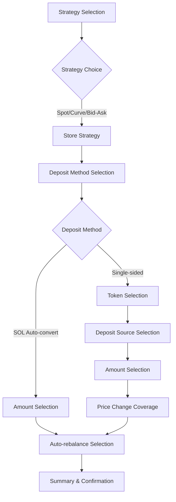
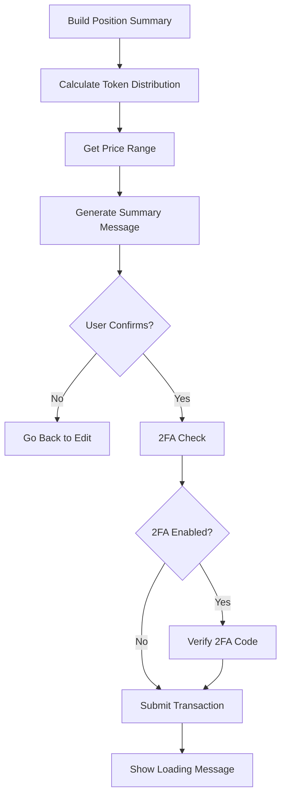
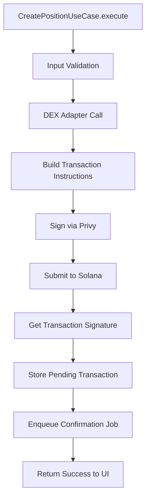
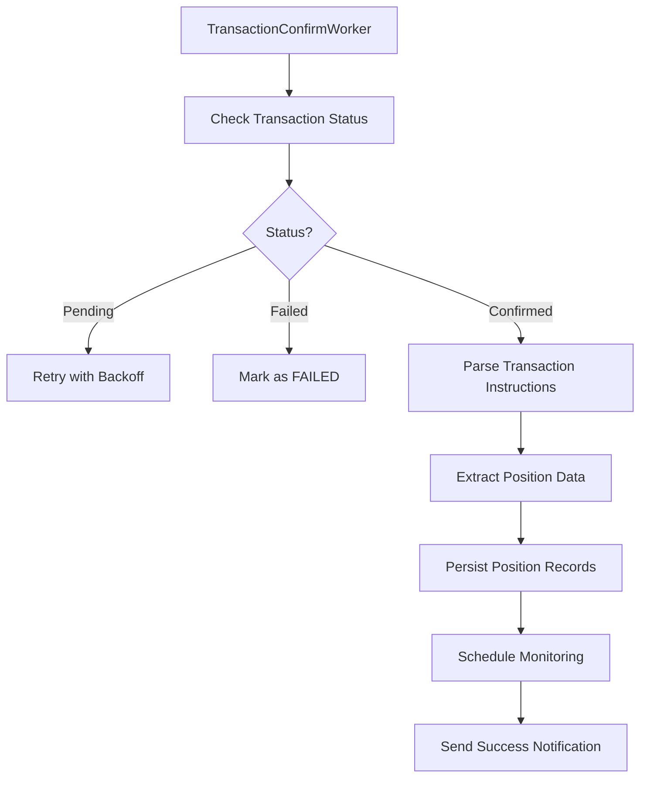

# Position Creation Flow Documentation

## Overview

This document describes the complete position creation flow for Meteora DLMM positions, from user interaction through transaction confirmation and database persistence. The flow follows the system design architecture: Presentation → Application → Infrastructure → DEX Adapter → Blockchain → Worker → Database.

## Architecture Components

### Core Components

1. **Presentation Layer**
   - `create-position.scene.ts` - Wizard scene guiding users through position creation
   - Handles user input validation, state management, and UI rendering

2. **Application Layer**
   - `create-position.use-case.ts` - Business logic orchestration
   - `calculate-balanced-distribution.use-case.ts` - Token distribution calculations
   - `get-price-range.use-case.ts` - Price range calculations

3. **Infrastructure Layer**
   - `transaction-confirm.worker.ts` - Background transaction processing
   - `job-queue.service.ts` - Job management and retries
   - `position-persistence.service.ts` - Database operations

4. **DEX Layer**
   - `meteora.adapter.ts` - Meteora DLMM integration
   - Implements `IDexAdapter` interface for multi-DEX support

5. **Data Layer**
   - `positions` table - Main position records
   - `positionSegments` table - Segment tracking for rebalancing
   - `pendingTransactions` table - Transaction tracking

## Complete Flow Sequence

### Phase 1: Entry & Bootstrap

```mermaid
flowchart TD
    A[User taps "Create Position"] --> B[Enter CREATE_POSITION_SCENE]
    B --> C[Validate User Prerequisites]
    C --> D{Wallet Connected?}
    D -- No --> E[Show Connect Wallet CTA]
    D -- Yes --> F[Load Pool Context]
    F --> G{Pool Available?}
    G -- No --> H[Show Error & Exit]
    G -- Yes --> I[Store Pool Data in Scene State]
    I --> J[Display Strategy Selection]
```

**Implementation Details:**
- Scene validates user authentication via `ctx.user`
- Checks wallet connection (`user.walletAddress` and `user.walletId`)
- Loads pool data via `GetPoolDetailsUseCase`
- Stores `poolData` in wizard state for subsequent steps

### Phase 2: Wizard Data Collection



**Scene State Management:**
```typescript
type WizardState = {
  step: "strategy_selection" | "deposit_method" | "token_selection" | 
        "deposit_source" | "amount" | "price_change_selection" | "confirm";
  poolAddress: string;
  dex: DexType;
  poolData: UnifiedPool;
  strategy: MeteoraCreatePositionStrategy;
  depositMethod: "sol_auto_convert" | "single_sided";
  selectedToken?: Token;
  depositSource?: "sol_convert" | "token_balance";
  amount?: number;
  priceChangePercentage?: number;
  autoRebalancing?: "yes" | "no";
  // ... other fields
};
```

**Step-by-Step Implementation:**

1. **Strategy Selection**
   - Present: Spot (balanced), Curve (concentrated), Bid-Ask (one-sided)
   - Store strategy enum in `wizardState.strategy`
   - Default to "Spot" for beginners

2. **Deposit Method Selection**
   - SOL Auto-convert: Swap SOL to both tokens automatically
   - Single-sided: Provide liquidity on one side only
   - Branch subsequent wizard steps based on choice

3. **Token Selection (Single-sided only)**
   - Fetch token balances via `GetTokenBalanceUseCase`
   - Display available tokens with actual balances
   - Store selected token metadata

4. **Amount Selection**
   - Validate SOL balance via `GetBalanceUseCase`
   - Offer preset buttons: 25%, 50%, 75%, 100% of balance
   - Support custom amount input with validation
   - Reserve buffer for transaction fees

5. **Price Change Coverage (Single-sided only)**
   - Collect percentage for price range: ±5%, ±10%, ±20%, ±50%
   - Calculate and display estimated price range
   - Store `priceChangePercentage`

6. **Auto-rebalancing Configuration**
   - Default: Yes (recommended)
   - User can opt-out or set custom threshold
   - Store preference for position monitoring

### Phase 3: Summary & Confirmation



**Summary Generation:**
- Use `CalculateBalancedDistributionUseCase` for 50/50 token splits
- Use `GetPriceRangeUseCase` for price range preview
- Display estimated fees, expected APY, and composition
- Show clear "Confirm & Create" call-to-action

**2FA Integration:**
- Check `ctx.user.twoFactorEnabled`
- Prompt for 6-digit code if enabled
- Verify via `TwoFactorAuthService.verifyToken()`
- Abort on failed verification with retry limit

### Phase 4: Transaction Orchestration



**CreatePositionUseCase Implementation:**

1. **Input Validation**
   ```typescript
   // Validate required fields
   if (!command.user?.walletAddress) return error;
   if (!command.poolAddress) return error;
   if (!command.tokenAAmount || !command.tokenBAmount) return error;
   ```

2. **Position Creation Context Assembly**
   ```typescript
   const positionContext: PositionCreationContext = {
     userId: command.user.id,
     walletAddress: command.user.walletAddress,
     dex: command.dex,
     poolAddress: command.poolAddress,
     strategy: command.strategy,
     depositMethod: command.depositMethod,
     tokenAAmount: command.tokenAAmount,
     tokenBAmount: command.tokenBAmount,
     autoRebalance: command.autoRebalance,
     slippage: command.slippage,
     // ... other metadata
   };
   ```

3. **DEX Adapter Integration**
   ```typescript
   const adapter = dexRegistry.get(command.dex);
   const result = await adapter.createPositionIx({
     poolAddress: command.poolAddress,
     userAddress: command.user.walletAddress,
     tokenAAmount: command.tokenAAmount,
     tokenBAmount: command.tokenBAmount,
     strategy: command.strategy,
     slippage: command.slippage,
   });
   ```

4. **Transaction Submission**
   ```typescript
   if (result.success && result.signature) {
     // Store pending transaction
     await db.insert(pendingTransactions).values({
       signature: result.signature,
       operationType: "CREATE_POSITION",
       userId: command.user.id,
       status: "PENDING",
       metadata: JSON.stringify(positionContext),
     });
     
     // Enqueue confirmation job
     await jobQueue.enqueue(JOB_TX_CONFIRM, {
       signature: result.signature,
       operationType: "CREATE_POSITION",
       userId: command.user.id,
       positionAddress: result.positionAddress,
     });
   }
   ```

### Phase 5: Transaction Confirmation & Persistence



**Worker Processing Steps:**

1. **Transaction Status Monitoring**
   ```typescript
   const status = await this.solana.getSignatureStatus(signature);
   if (!status.confirmationStatus && !status.err) {
     // Retry with exponential backoff
     throw new Error("Transaction pending");
   }
   ```

2. **Transaction Parsing**
   ```typescript
   const parsedTx = await connection.getParsedTransaction(signature);
   const instructions = parseMeteoraInstructions(parsedTx);
   
   // Extract position creation data
   const initializeInstruction = instructions.find(ix => ix.instructionType === "open");
   const addLiquidityInstruction = instructions.find(ix => ix.instructionType === "add");
   ```

3. **Data Extraction**
   ```typescript
   // Get actual deposited amounts from token transfers
   const tokenATransfer = addLiquidityInstruction.tokenTransfers.find(
     t => t.mint === context.tokenAMint
   );
   const tokenBTransfer = addLiquidityInstruction.tokenTransfers.find(
     t => t.mint === context.tokenBMint
   );
   
   const actualTokenAAmount = tokenATransfer.amount / Math.pow(10, tokenADecimals);
   const actualTokenBAmount = tokenBTransfer.amount / Math.pow(10, tokenBDecimals);
   ```

4. **Database Persistence**
   ```typescript
   // Create position record
   const positionId = await positionPersistenceService.createPosition({
     signature,
     positionAddress: effectivePositionAddress,
     context: positionContext,
     onChainData: {
       actualTokenAAmount,
       actualTokenBAmount,
     },
     prices: {
       tokenAUsd: priceData[tokenAMint]?.price,
       tokenBUsd: priceData[tokenBMint]?.price,
       solUsd: priceData[solMint]?.price,
     },
   });
   
   // Create initial segment
   await positionPersistenceService.createSegment({
     positionId,
     segmentNumber: 1,
     startTimestamp: new Date(),
     initialValueUSD: calculatedValue,
   });
   
   // Create creation snapshot
   await positionPersistenceService.createSnapshot({
     positionId,
     type: "creation",
     tokenBalances: { /* current balances */ },
     usdValues: { /* calculated values */ },
   });
   ```

### Phase 6: Post-Creation Actions

1. **Cache Invalidation**
   ```typescript
   await this.cache.invalidate(CachePatterns.portfolioPattern(userId));
   await this.cache.invalidate(CachePatterns.positionPattern(positionId));
   ```

2. **Monitoring Job Scheduling**
   ```typescript
   if (positionContext.autoRebalance) {
     await jobQueue.enqueue(JOB_POSITION_MONITOR, {
       userId,
       positionId,
     }, {
       repeat: { every: 60 * 60 * 1000 }, // Every hour
     });
   }
   ```

3. **Success Notification**
   ```typescript
   await jobQueue.enqueue(JOB_NOTIFICATION, {
     userId,
     notification: {
       type: "general",
       title: "Position Created",
       message: "Your position has been successfully created!",
     },
   });
   ```

## Error Handling

### Scene-Level Errors
- **Insufficient Balance**: Show exact shortfall and suggest amounts
- **Invalid Custom Amount**: Validate numeric input and range
- **Pool Not Found**: Graceful exit with helpful error message
- **Network Errors**: Retry with user-friendly messages

### Transaction-Level Errors
- **Signature Rejection**: User cancelled - allow retry
- **RPC Timeout**: Automatic retry with exponential backoff
- **Slippage Exceeded**: Suggest higher slippage or retry
- **Insufficient Funds**: Clear message about required amount + fees

### Worker-Level Errors
- **Transaction Parsing Failure**: Log and retry with exponential backoff
- **Database Persistence Failure**: Critical error - alert for manual intervention
- **Price Fetch Failure**: Use cached prices with warning

## Data Models

### PositionCreationContext
Complete context stored in pending transaction metadata:
```typescript
interface PositionCreationContext {
  // User context
  userId: string;
  walletAddress: string;
  walletId?: string;

  // Pool context
  dex: DexType;
  poolAddress: string;
  tokenA: Token;
  tokenB: Token;
  strategy: string;

  // Deposit details
  depositMethod: "sol_auto_convert" | "single_sided";
  depositSource?: "sol_convert" | "token_balance";
  solAmount?: number;
  tokenAAmount: string;
  tokenBAmount: string;

  // Price range
  priceRange?: {
    min: number;
    max: number;
    rangeInterval: number;
  };

  // Risk management
  autoRebalance: boolean;
  rebalanceThreshold?: number;
  slPercentage?: number;
  tpPercentage?: number;

  // Transaction metadata
  expectedFeesLamports?: number;
  slippage?: number;
  positionAddress?: string;
}
```

### Database Records Created

1. **Position Record** (`positions` table)
   - Basic position information and metadata
   - Initial investment tracking
   - Strategy and risk parameters

2. **Position Segment** (`positionSegments` table)
   - Segment 1 for new positions
   - Start timestamp and initial value
   - Links to position for lifecycle tracking

3. **Position Snapshot** (`positionSnapshots` table)
   - Type: "creation"
   - Token balances and USD values at creation
   - Price data for historical tracking

4. **Pending Transaction** (`pendingTransactions` table)
   - Operation type: "CREATE_POSITION"
   - Complete PositionCreationContext in metadata
   - Status tracking through confirmation

## Integration Points

### Entry Points
All position creation entry points must funnel into `CREATE_POSITION_SCENE`:
- Trending pools "➕ Open Position" button
- Portfolio "Add Position" CTA  
- `/create` command
- Pool URL auto-detection and parsing

### Exit Points
Successful creation exits to:
- Position detail scene for new position
- Portfolio view with updated positions
- Success notification with transaction link

Failed creation exits to:
- Previous wizard step for correction
- Main menu with error message
- Support contact for unresolved issues

## Performance Considerations

### Optimization Points
1. **Pool Data Caching**: Cache pool details for 5-minute TTL
2. **Price Data Batching**: Fetch all token prices in single call
3. **Transaction Simulation**: Pre-validate transactions to avoid failures
4. **Async Operations**: Parallel RPC calls where possible

### Monitoring Metrics
- Position creation success rate
- Average time from wizard start to confirmation
- Failure reasons and frequency
- User drop-off points in wizard

This flow ensures a robust, user-friendly position creation experience that maintains data consistency and provides clear feedback throughout the process.