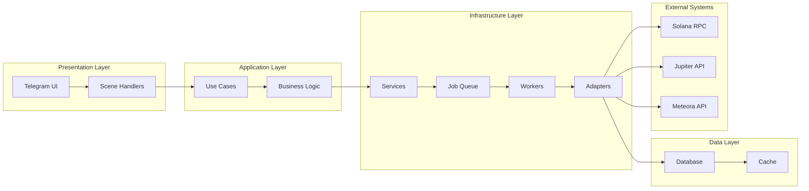
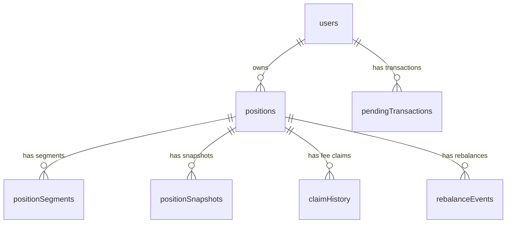

# Position Lifecycle Overview

## Overview

This document provides a high-level overview of the complete position lifecycle in the Meteora Liquidity Bot, from creation through closure and all intermediate operations. It serves as the master reference for understanding how all position flows interconnect and maintain data consistency throughout the position's lifetime.

## Lifecycle States

```mermaid
stateDiagram-v2
    [*] --> Created
    Created --> Active
    Active --> Rebalancing
    Rebalancing --> Active
    Active --> Closed
    Closed --> [*]
    
    note right of Created
        "Position just created\nMonitoring starts\nAuto-rebalance configured"
    
    note right of Active
        "Position earning fees\nIn-range monitoring\nUser can claim fees\nManual rebalance available"
    
    note right of Rebalancing
        "Position temporarily inactive\nClose + recreate in progress\nUser actions blocked"
    
    note right of Closed
        "Position liquidated\nAll fees claimed\nPnL calculated\nCannot be reactivated"
```

## Core Operations by State

### 1. Created State

**Duration**: Until transaction confirmation (typically 30-60 seconds)

**Available Operations**:
- None (user must wait for confirmation)

**System Actions**:
- Transaction monitoring via `transaction-confirm.worker`
- Position creation via `position-persistence.service`
- Initial segment creation
- Cache invalidation
- Monitoring job scheduling

**Entry Point**: Position creation flow completion
**Exit Condition**: Transaction confirmation and database persistence

---

### 2. Active State

**Duration**: From confirmation until closure (hours to months)

**Available Operations**:
- **Claim Fees**: Manual fee collection with SOL conversion
- **Manual Rebalance**: User-initiated position recreation
- **View Details**: Monitor performance, PnL, and metrics
- **Configure Settings**: Update auto-rebalance preferences

**System Actions**:
- Periodic position monitoring (every 5-60 minutes)
- Fee accumulation tracking
- PnL calculation updates
- Auto-rebalancing triggers (if configured)

**Entry Point**: Transaction confirmation completion
**Exit Condition**: User initiation of close/rebalance or system triggers

---

### 3. Rebalancing State

**Duration**: Close + recreate transaction process (typically 2-5 minutes)

**Available Operations**:
- None (position temporarily inactive)

**System Actions**:
- Close current position transaction
- SOL conversion of withdrawn liquidity
- Create new position transaction
- Segment closure and creation
- Rebalance event recording

**Entry Point**: User or system rebalancing trigger
**Exit Condition**: Successful recreation and database updates

---

### 4. Closed State

**Duration**: Permanent (until manually deleted from history)

**Available Operations**:
- **View History**: Examine closed position details
- **View PnL**: Analyze performance metrics
- **Export Data**: Download transaction history

**System Actions**:
- Final PnL calculation
- Historical data preservation
- Portfolio updates (removal from active)

**Entry Point**: Position closure flow completion
**Exit Condition**: Permanent state (manual deletion only)

## Data Flow Architecture

### Horizontal Data Flow



### Vertical Flow by Operation

#### Position Creation
```
User Input → Scene Validation → Use Case Logic → DEX Adapter → Transaction → Worker Confirmation → Database Persistence → Cache Update → User Notification
```

#### Claim Fees
```
Position Detail → Use Case Validation → DEX Adapter → Transaction → Worker Confirmation → SOL Conversion → Database Update → Cache Invalidation → User Notification
```

#### Rebalance
```
Position Detail → Use Case Logic → Close Transaction → Worker Processing → SOL Conversion → Create Transaction → Worker Processing → Database Updates → Cache Invalidation → User Notification
```

#### Close Position
```
Position Detail → Use Case Validation → DEX Adapter → Transaction → Worker Confirmation → SOL Conversion → Database Updates → Cache Invalidation → User Notification
```

## Key Data Entities

### Core Tables

1. **positions** - Master position records
   - Current state and status
   - Investment and return tracking
   - Strategy and risk parameters

2. **positionSegments** - Lifecycle tracking
   - Each rebalance creates new segment
   - Segment-level PnL tracking
   - Start/end timestamps

3. **positionSnapshots** - State preservation
   - Creation, claim, rebalance, closure snapshots
   - Historical performance data
   - Price and balance history

4. **claimHistory** - Fee tracking
   - All fee claim operations
   - SOL conversion records
   - USD value calculations

5. **rebalanceEvents** - Rebalance tracking
   - Close/create correlation
   - Performance metrics
   - Session coordination

6. **pendingTransactions** - Transaction coordination
   - All blockchain operations
   - Status tracking
   - Retry logic

### Data Relationships



## Transaction Coordination

### Pending Transaction Lifecycle

```mermaid
stateDiagram-v2
    [*] --> Pending
    Pending --> Processing
    Processing --> Completed
    Processing --> Failed
    Failed --> Retry
    Retry --> Processing
    Completed --> [*]
    
    note right of Pending
        "Submitted to blockchain\nAwaiting confirmation"
    
    note right of Processing
        "Worker actively processing\nParsing and persisting"
    
    note right of Failed
        "Transaction failed\nWill retry with backoff"
```

### Operation Correlation

**Rebalance Session Coordination**:
- UUID generated to correlate close and create transactions
- Temporary storage in Redis during processing
- Automatic cleanup after completion

**Multi-Operation Transactions**:
- Position rebalancing: CLOSE_POSITION + CREATE_POSITION
- Position closure: CLOSE_POSITION + CLAIM_FEES
- All operations tracked through pending transactions table

## Error Recovery

### Automatic Recovery Mechanisms

1. **Transaction Retries**
   - Exponential backoff: 2s, 4s, 8s
   - Maximum 3 attempts
   - Circuit breaker after failures

2. **State Consistency**
   - Position status updates prevent concurrent operations
   - Segment tracking ensures data integrity
   - Atomic database transactions

3. **Cache Invalidation**
   - Portfolio cache invalidated on any position change
   - Position cache invalidated on position updates
   - Automatic refresh on next access

### Manual Recovery Points

1. **Stuck Positions**
   - Manual rebalance trigger available
   - Support can intervene on stuck transactions
   - Position closure always available

2. **Data Reconciliation**
   - Daily reconciliation jobs
   - Automatic detection of inconsistencies
   - Alert on unrecoverable errors

## Performance Optimization

### Caching Strategy

1. **Multi-Level Caching**
   - L1: In-memory (process-level)
   - L2: Redis (application-level)
   - L3: CDN (static assets)

2. **Cache Patterns**
   - `portfolio:{userId}` - 5-minute TTL
   - `position:{positionId}` - 2-minute TTL
   - `pool:{dex}:{poolId}` - 10-minute TTL
   - `prices:*` - 1-minute TTL

### Database Optimization

1. **Index Strategy**
   - Primary keys on all tables
   - Foreign key indexes
   - Status and timestamp indexes

2. **Query Optimization**
   - Batch operations where possible
   - Pagination for large result sets
   - Prepared statements for repeated queries

### Background Processing

1. **Job Queue Configuration**
   - Priority queues for different operation types
   - Concurrent worker limits
   - Dead letter queue for failed jobs

2. **Monitoring Jobs**
   - Position monitoring: 5-60 minute intervals
   - Portfolio sync: 10-minute intervals
   - Health checks: Hourly

## Security Considerations

### Transaction Security

1. **User Authorization**
   - All operations verify user ownership
   - Wallet signature required for all transactions
   - 2FA enforcement for sensitive operations

2. **Input Validation**
   - Address format validation
   - Amount range checking
   - Slippage bounds enforcement

3. **Rate Limiting**
   - Per-user operation limits
   - Global rate limits
   - Exponential backoff on failures

### Data Protection

1. **Encryption at Rest**
   - Sensitive user data encrypted
   - Private keys never stored
   - Secure key management via Privy

2. **Audit Trail**
   - All operations logged
   - Transaction signatures stored
   - User action tracking

## Integration Patterns

### DEX Adapter Pattern

All DEX operations go through standardized interface:
```typescript
interface IDexAdapter {
  createPosition(params): Promise<TransactionResult>
  closePosition(params): Promise<TransactionResult>
  claimFeesIx(params): Promise<ClaimFeesResult>
  rebalancePosition(address, params): Promise<TransactionResult>
  // ... other methods
}
```

### Service Layer Pattern

Business logic encapsulated in use cases:
- Input validation and sanitization
- Error handling and user-friendly messages
- Transaction orchestration
- Database coordination

### Worker Pattern

Background processing follows consistent pattern:
1. Receive job data
2. Validate and parse transaction
3. Extract relevant data
4. Update database records
5. Invalidate caches
6. Send notifications

## Monitoring & Observability

### Key Metrics

1. **Business Metrics**
   - Position creation rate
   - Active position count
   - Fee claim frequency
   - Rebalance success rate
   - Position closure rate

2. **Technical Metrics**
   - Transaction confirmation time
   - Worker job processing time
   - Database query performance
   - Cache hit/miss ratios

3. **Error Metrics**
   - Failure rates by operation type
   - Error categorization
   - Retry frequency
   - User drop-off points

### Alerting

1. **Critical Alerts**
   - Database connection failures
   - Worker queue stalls
   - Transaction processing failures
   - Security violations

2. **Warning Alerts**
   - High error rates
   - Performance degradation
   - Cache miss spikes

This lifecycle overview provides a comprehensive understanding of how positions flow through the system, ensuring all team members have a clear picture of the complete position management process and its various interconnected components.