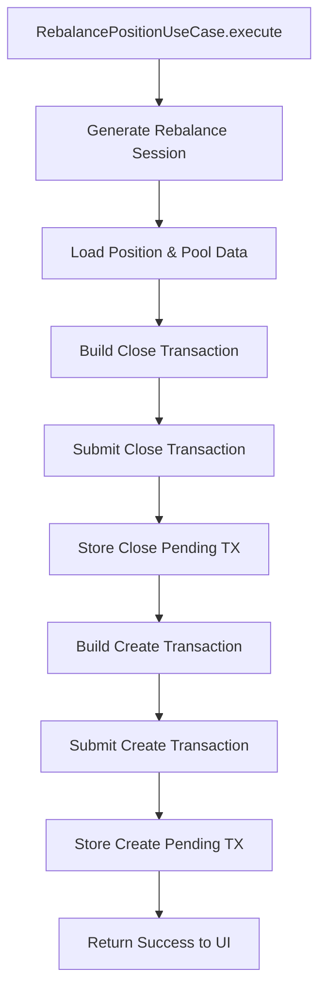
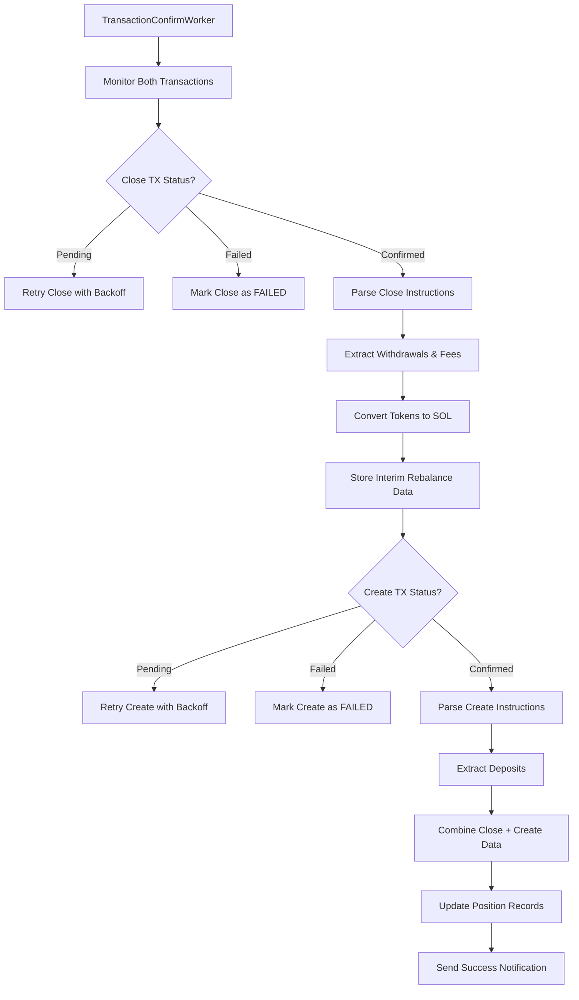
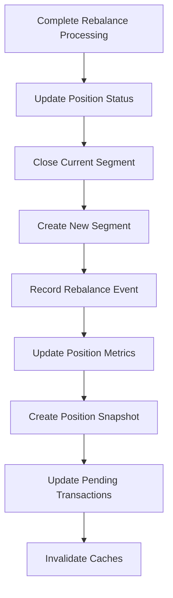

# Position Rebalance Flow Documentation

## Overview

This document describes the complete position rebalancing flow for Meteora DLMM positions, from user initiation through coordinated close and recreate transactions. The flow follows system design architecture: Presentation → Application → Infrastructure → DEX Adapter → Blockchain → Worker → Database.

## Architecture Components

### Core Components

1. **Presentation Layer**
   - `position-detail.scene.ts` - Position detail view with rebalance action
   - Handles user confirmation and progress feedback

2. **Application Layer**
   - `rebalance-position.use-case.ts` - Business logic orchestration
   - Coordinates close and create transactions for rebalancing

3. **Infrastructure Layer**
   - `transaction-confirm.worker.ts` - Background transaction processing
   - `swap.service.ts` - Token-to-SOL conversion via Jupiter
   - `rebalance-persistence.service.ts` - Database operations

4. **DEX Layer**
   - `meteora.adapter.ts` - Meteora DLMM integration
   - Implements `IDexAdapter.closePositionIx()` and `createPositionIx()`

5. **Data Layer**
   - `positions` table - Main position records with segment tracking
   - `positionSegments` table - Individual segment lifecycle tracking
   - `rebalanceEvents` table - Rebalancing operation history
   - `pendingTransactions` table - Transaction coordination

## Complete Flow Sequence

### Phase 1: User Initiation

```mermaid
flowchart TD
    A[User views Position Detail] --> B[Clicks "Rebalance"]
    B --> C[Load Position Data]
    C --> D{Position Active & In Range?}
    D -- No --> E[Show "Cannot Rebalance" Message]
    D -- Yes --> F[Display Rebalance Confirmation]
    F --> G{User Confirms?}
    G -- No --> H[Return to Position Detail]
    G -- Yes --> I[Show Loading Message]
```

**Implementation Details:**
- Scene loads position via `GetPositionUseCase`
- Validates position status is "ACTIVE" and `inRange: false`
- Shows confirmation dialog with rebalancing costs and benefits
- Displays "🔄 Rebalance" confirmation keyboard

### Phase 2: Transaction Orchestration



**RebalancePositionUseCase Implementation:**

1. **Session Generation**
   ```typescript
   const rebalanceSessionId = randomUUID();
   const rebalanceSession: RebalanceSessionMetadata = {
     id: rebalanceSessionId,
     positionId: command.positionId,
     closeSignature: null, // Will be populated later
     createSignature: null,
     strategy: position.strategyType,
     rangeInterval: position.balancedPositionBinRange,
   };
   ```

2. **Position Validation**
   ```typescript
   const position = await this.positionRepository.findById(command.positionId);
   if (!position) return { success: false, error: "Position not found" };
   if (position.userId !== command.userId) {
     return { success: false, error: "Unauthorized" };
   }
   ```

3. **Close Transaction Building**
   ```typescript
   const adapter = this.dexRegistry.get(position.dex);
   const closeTx = await adapter.closePositionIx({
     userAddress: command.userAddress,
     poolAddress: position.poolAddress,
     positionAddress: position.positionAddress,
   });
   ```

4. **Create Transaction Building**
   ```typescript
   const createTx = await adapter.createPositionIx({
     poolAddress: position.poolAddress,
     userAddress: command.userAddress,
     tokenAAmount: calculatedTokenAAmount, // From close proceeds
     tokenBAmount: calculatedTokenBAmount,
     strategy: position.strategyType,
     rangeInterval: position.balancedPositionBinRange,
   });
   ```

5. **Coordinated Submission**
   ```typescript
   // Submit close transaction first
   const closeResult = await this.transactionService.submit(closeTx);
   
   // Store close pending transaction with rebalance context
   await db.insert(pendingTransactions).values({
     signature: closeResult.signature,
     operationType: "CLOSE_POSITION",
     userId: command.userId,
     status: "PENDING",
     metadata: JSON.stringify({
       closeContext: { /* close details */ },
       rebalanceSession: rebalanceSession,
     }),
   });
   
   // Submit create transaction immediately after
   const createResult = await this.transactionService.submit(createTx);
   
   // Store create pending transaction with same session
   await db.insert(pendingTransactions).values({
     signature: createResult.signature,
     operationType: "CREATE_POSITION",
     userId: command.userId,
     status: "PENDING",
     metadata: JSON.stringify({
       positionCreationContext: { /* creation details */ },
       rebalanceSession: rebalanceSession,
     }),
   });
   ```

### Phase 3: Transaction Confirmation & Processing



**Worker Processing Steps:**

1. **Close Transaction Handler**
   ```typescript
   async handleClosePosition(jobData) {
     // Parse close transaction
     const closeResult = await this.extractCloseInstructionData(jobData.signature);
     
     // Convert withdrawn tokens to SOL
     const solProceeds = await this.convertWithdrawnTokensToSol(
       closeResult.finalTokenAAmount,
       closeResult.finalTokenBAmount,
       jobData.userId
     );
     
     // Store interim rebalance data
     await this.cache.set(`rebalance:${jobData.rebalanceSessionId}`, {
       closeData: closeResult,
       solProceeds,
       timestamp: new Date(),
     }, { ttl: 30 * 60 }); // 30 minutes
   }
   ```

2. **Create Transaction Handler**
   ```typescript
   async handleCreatePosition(jobData) {
     // Parse create transaction
     const createResult = await this.extractCreateInstructionData(jobData.signature);
     
     // Retrieve stored close data
     const closeData = await this.cache.get(`rebalance:${jobData.rebalanceSessionId}`);
     
     if (closeData) {
       // Combine close and create data for complete rebalance
       await this.processCompleteRebalance(jobData, createResult, closeData);
     } else {
       // Handle as standalone creation
       await this.processStandaloneCreation(jobData, createResult);
     }
   }
   ```

3. **Complete Rebalance Processing**
   ```typescript
   async processCompleteRebalance(createJobData, createResult, closeData) {
     const rebalanceData = {
       sessionId: createJobData.rebalanceSessionId,
       positionId: createJobData.positionId,
       
       // Close leg data
       closeSignature: closeData.closeData.signature,
       withdrawals: closeData.closeData.withdrawals,
       feesClaimed: closeData.closeData.feesClaimed,
       solFromClose: closeData.solProceeds,
       
       // Create leg data
       createSignature: createJobData.signature,
       deposits: createResult.deposits,
       solUsedForCreate: createResult.solUsed,
       
       // Calculated metrics
       netSolChange: closeData.solProceeds - createResult.solUsed,
       totalValueUsd: createResult.totalValueUsd,
     };
     
     // Call rebalance persistence service
     await rebalancePersistenceService.completeRebalance(rebalanceData);
   }
   ```

### Phase 4: Database Persistence



**Database Operations:**

1. **Position Status Update**
   ```typescript
   // Set position to REBALANCING during process
   await db
     .update(positions)
     .set({ status: "REBALANCING" })
     .where(eq(positions.id, positionId));
   
   // Set back to ACTIVE after successful rebalance
   await db
     .update(positions)
     .set({ 
       status: "ACTIVE",
       positionAddress: newPositionAddress, // Updated address
       currentSegmentNumber: currentSegmentNumber + 1,
       currentSegmentStartAt: new Date(),
     })
     .where(eq(positions.id, positionId));
   ```

2. **Segment Management**
   ```typescript
   // Close current segment
   await positionPersistenceService.closeSegment({
     positionId,
     segmentNumber: currentSegmentNumber,
     endTimestamp: new Date(),
     finalValueUSD: closeData.valueUsd,
     realizedPnlUSD: closeData.pnlUsd,
     closureReason: "rebalance",
   });
   
   // Create new segment
   await positionPersistenceService.createSegment({
     positionId,
     segmentNumber: currentSegmentNumber + 1,
     startTimestamp: new Date(),
     initialValueUSD: createData.valueUsd,
   });
   ```

3. **Rebalance Event Record**
   ```typescript
   await db.insert(rebalanceEvents).values({
     positionId,
     sessionId: rebalanceSessionId,
     closeSignature,
     createSignature,
     closeValueUSD: closeData.valueUsd,
     createValueUSD: createData.valueUsd,
     netSolChange: rebalanceData.netSolChange,
     feesClaimedUSD: closeData.feesClaimedUsd,
     realizedPnlUSD: closeData.pnlUsd,
     rebalanceReason: "manual", // or "auto" for automatic
   });
   ```

4. **Position Snapshot**
   ```typescript
   await positionPersistenceService.createSnapshot({
     positionId,
     type: "rebalance",
     tokenBalances: { /* post-rebalance balances */ },
     usdValues: { /* calculated values */ },
     prices: currentPrices,
   });
   ```

### Phase 5: Post-Rebalance Actions

1. **Cache Invalidation**
   ```typescript
   await this.cache.invalidate(CachePatterns.portfolioPattern(userId));
   await this.cache.invalidate(CachePatterns.positionPattern(positionId));
   // Clear interim rebalance data
   await this.cache.delete(`rebalance:${rebalanceSessionId}`);
   ```

2. **Success Notification**
   ```typescript
   await jobQueue.enqueue(JOB_NOTIFICATION, {
     userId,
     notification: {
       type: "rebalance",
       title: "Position Rebalanced",
       message: `Your position has been rebalanced! Net SOL change: ${netSolChange.toFixed(4)}`,
       data: {
         sessionId: rebalanceSessionId,
         oldRange: "97.4 - 107.6",
         newRange: "119.0 - 146.0",
         pnlUsd: closeData.pnlUsd,
       },
     },
   });
   ```

## Error Handling

### User-Level Errors
- **Position Not Active**: Only allow rebalancing for active positions
- **Position In Range**: Show message that rebalancing not needed
- **Insufficient SOL**: Check if user has enough SOL for transaction fees

### Transaction-Level Errors
- **Close Transaction Failed**: Allow retry without affecting original position
- **Create Transaction Failed**: Keep position in REBALANCING state for manual retry
- **SOL Conversion Failed**: Use price-based estimation as fallback

### Worker-Level Errors
- **Missing Rebalance Session**: Handle create transaction as standalone
- **Close/Create Mismatch**: Log error and maintain position status
- **Persistence Failure**: Critical error - alert for manual intervention

## Data Models

### RebalanceSessionMetadata
Coordinates close and create transactions:
```typescript
interface RebalanceSessionMetadata {
  id: string; // UUID for correlation
  positionId: string;
  closeSignature?: string;
  createSignature?: string;
  strategy: string;
  rangeInterval: number;
}
```

### RebalanceEventData
Record stored in `rebalanceEvents` table:
```typescript
interface RebalanceEventData {
  positionId: string;
  sessionId: string;
  closeSignature: string;
  createSignature: string;
  closeValueUSD: number;
  createValueUSD: number;
  netSolChange: number;
  feesClaimedUSD: number;
  realizedPnlUSD: number;
  rebalanceReason: "manual" | "auto";
  createdAt: Date;
}
```

### Database State Transitions

**Position Status Flow:**
```
ACTIVE → REBALANCING → ACTIVE
```

**Segment Number Flow:**
```
Segment N (active) → Segment N (closed) → Segment N+1 (active)
```

## Integration Points

### Entry Points
- Position detail scene "🔄 Rebalance" button
- Auto-rebalancing trigger from position monitoring worker
- Manual rebalancing from portfolio view

### Exit Points
Successful rebalance exits to:
- Updated position detail view with new range
- Portfolio view with refreshed position
- Success notification with transaction links

Failed rebalance exits to:
- Position detail view with error message
- Original position preserved (if close failed)
- Retry option for transient failures

## Performance Considerations

### Optimization Points
1. **Transaction Batching**: Submit close and create in quick succession
2. **Session Coordination**: Use Redis for temporary rebalance state
3. **Price Data Caching**: Cache prices for both close and create legs
4. **Async Operations**: Parallel SOL conversions where possible

### Monitoring Metrics
- Rebalance success rate
- Average time from initiation to completion
- Net SOL change distribution
- User rebalancing frequency
- Failure reasons and frequency

This flow ensures seamless position rebalancing with proper coordination between close and create transactions, maintaining data consistency and providing clear user feedback throughout the process.