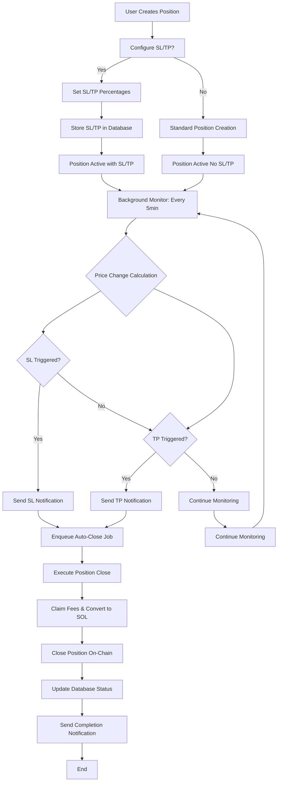

# Stop Loss & Take Profit Flow Diagram

## System Flow Overview



## Detailed Component Flow

### 1. Position Creation Phase

#### A. User Interface Layer
```mermaid
sequenceDiagram
    participant User
    participant Bot as UI
    participant Scene as Wizard
    participant UseCase as UC
    participant DB as Database
    
    User->>Bot: /create
    Bot->>Scene: Load Pool Selection
    User->>Scene: Select Pool
    Scene->>Scene: Strategy Selection
    Scene->>Scene: Deposit Method
    Scene->>Scene: Amount Selection
    Scene->>Scene: Auto-Rebalancing
    Scene->>Scene: Risk Management (NEW)
    
    Note over Scene: SL/TP Configuration
    User->>Scene: Select Risk Management
    alt User sets Stop Loss
    alt User sets Take Profit
    alt User skips Risk Management
    
    Scene->>Scene: Summary with SL/TP
    User->>Scene: Confirm Position
    Scene->>UC: Create Position with SL/TP
    UC->>DB: Store Position with SL/TP fields
```

#### B. Database Persistence
```sql
-- Position record includes SL/TP settings
INSERT INTO positions (
  id, userId, positionAddress, poolAddress,
  slPercentage,  -- Stop loss percentage
  tpPercentage,  -- Take profit percentage
  -- ... other position fields
) VALUES (
  'uuid-1', 'user-1', 'position-address-1',
  'pool-address-1', 'meteora',
  10.0,          -- 10% stop loss
  25.0,          -- 25% take profit
  -- ... other values
);
```

### 2. Monitoring Phase

#### A. Position Monitor Worker
```mermaid
sequenceDiagram
    participant Scheduler
    participant Monitor as Worker
    participant PriceService
    participant DB as Database
    participant Notification as Notify
    participant JobQueue as Jobs
    
    Scheduler->>Monitor: Execute every 5 minutes
    Monitor->>DB: Get position with SL/TP
    Monitor->>PriceService: Get current price
    PriceService->>Monitor: Return current price
    
    Note over Monitor: Calculate triggers
    Monitor->>Monitor: Calculate price change % = ((current - entry) / entry) × 100
    
    alt SL triggered
        Monitor->>Notify: Send stop loss alert
        Monitor->>Jobs: Queue auto-close job
    alt TP triggered
        Monitor->>Notify: Send take profit alert
        Monitor->>Jobs: Queue auto-close job
    else No trigger
        Monitor->>Monitor: Continue monitoring
```

#### B. Price Calculation Logic
```typescript
interface PriceCalculation {
  entryPriceUSD: number;      // From position creation
  currentPrice: number;      // From price service
  slPercentage?: number;     // From position settings
  tpPercentage?: number;     // From position settings
}

const calculateTriggers = (calc: PriceCalculation): {
  priceChangePercentage: number;
  stopLossTriggered: boolean;
  takeProfitTriggered: boolean;
} => {
  const priceChangePercentage = ((calc.currentPrice - calc.entryPriceUSD) / calc.entryPriceUSD) * 100;
  
  const stopLossTriggered = calc.slPercentage && 
    priceChangePercentage <= -calc.slPercentage;
  
  const takeProfitTriggered = calc.tpPercentage && 
    priceChangePercentage >= calc.tpPercentage;
  
  return {
    priceChangePercentage,
    stopLossTriggered,
    takeProfitTriggered,
  };
};
```

### 3. Auto-Close Execution Phase

#### A. Rebalance Worker Enhancement
```mermaid
sequenceDiagram
    participant Monitor as PositionMonitor
    participant Rebalance as RebalanceWorker
    participant UseCase as CloseUC
    participant DEX as Adapter
    participant Blockchain as Solana
    participant Notify as Notification
    
    PositionMonitor->>Rebalance: Trigger close job
    Note over Rebalance: reason = 'stop_loss_triggered' or 'take_profit_triggered'
    
    Rebalance->>CloseUC: Execute close position
    CloseUC->>DEX: Build close transaction
    DEX->>Blockchain: Submit transaction
    Blockchain->>DEX: Return signature
    DEX->>CloseUC: Return result
    CloseUC->>Rebalance: Return success/failure
    
    alt Success
        Rebalance->>Notify: Send SL/TP success notification
        Note over Notify: Different messages for SL vs TP
    else Failure
        Rebalance->>Notify: Send error notification
```

#### B. Transaction Execution Flow
```typescript
// Auto-close execution uses existing close position infrastructure
const executeAutoClose = async (position: Position, reason: string) => {
  // 1. Build close transaction
  const closeTx = await adapter.closePositionIx({
    positionAddress: position.positionAddress,
    userAddress: position.userAddress,
  });
  
  // 2. Sign and submit
  const signature = await WalletService.signAndSendTransaction(
    walletId,
    userAddress,
    closeTx.instructions
  );
  
  // 3. Process confirmation (existing flow)
  await processTransactionConfirmation(signature, 'AUTO_CLOSE', {
    positionId: position.id,
    triggerReason: reason,
  });
};
```

### 4. Notification System

#### A. Trigger Notifications
```typescript
// Stop Loss Notification
await notificationService.sendNotification(userId, {
  type: "position",
  title: "🛡️ Stop Loss Triggered",
  message: `Your position ${positionAddress.slice(0, 6)}... has hit stop loss at ${Math.abs(priceChangePercentage).toFixed(2)}%. Auto-closing position to limit losses.`,
});

// Take Profit Notification
await notificationService.sendNotification(userId, {
  type: "position", 
  title: "🎯 Take Profit Triggered",
  message: `Your position ${positionAddress.slice(0, 6)}... has hit take profit at ${priceChangePercentage.toFixed(2)}%. Auto-closing position to secure gains.`,
});
```

#### B. Completion Notifications
```typescript
// Success notification (different titles based on trigger)
const title = reason === 'stop_loss_triggered' 
  ? '🛡️ Stop Loss Executed'
  : '🎯 Take Profit Executed';

const message = reason === 'stop_loss_triggered'
  ? `Stop loss executed for position ${positionId}. Position closed at ${signature} to limit losses.`
  : `Take profit executed for position ${positionId}. Position closed at ${signature} to secure gains.`;
```

## Error Handling & Edge Cases

### 1. Configuration Validation
```typescript
// Input validation for SL/TP percentages
const validateSLPercentage = (sl: number): boolean => {
  return sl >= 1 && sl <= 100; // 1% to 100% range
};

const validateTPPercentage = (tp: number): boolean => {
  return tp >= 1 && tp <= 1000; // 1% to 1000% range
};
```

### 2. Price Data Issues
```typescript
// Fallback when price service unavailable
const fallbackPriceCalculation = (position: Position): PriceCalculation => {
  if (!currentPrice) {
    logger.warn("Price service unavailable, using last known price");
    return {
      priceChangePercentage: 0,
      stopLossTriggered: false,
      takeProfitTriggered: false,
    };
  }
  // Normal calculation
  return calculateTriggers(realData);
};
```

### 3. Transaction Failures
```typescript
// Retry logic for auto-close transactions
const executeAutoCloseWithRetry = async (position: Position, maxRetries = 3): Promise<boolean> => {
  for (let attempt = 1; attempt <= maxRetries; attempt++) {
    try {
      const result = await executeAutoClose(position);
      if (result.success) return true;
      
      await delay(Math.pow(2, attempt) * 1000); // Exponential backoff
    } catch (error) {
      logger.error(`Auto-close attempt ${attempt} failed`, { error, positionId: position.id });
      if (attempt === maxRetries) throw error;
    }
  }
  return false;
};
```

## Performance Considerations

### 1. Monitoring Frequency
- **Current**: Every 5 minutes per position
- **Load**: ~200 positions per monitoring cycle
- **Scaling**: Horizontal scaling support with job queue

### 2. Price Data Caching
```typescript
// Cache price data to reduce API calls
const priceCache = new Map<string, { price: number; timestamp: number }>();

const getCachedPrice = (tokenMint: string): number | null => {
  const cached = priceCache.get(tokenMint);
  if (cached && Date.now() - cached.timestamp < 60000) { // 1 minute TTL
    return cached.price;
  }
  return null; // Fetch fresh price
};
```

### 3. Database Optimization
```sql
-- Index for efficient position queries
CREATE INDEX idx_positions_sl_tp ON positions (userId, status) WHERE slPercentage IS NOT NULL OR tpPercentage IS NOT NULL;

-- Partition for active positions (optional for large scale)
CREATE TABLE positions_active PARTITION OF positions FOR VALUES IN ('ACTIVE');
```

## Security & Reliability

### 1. Transaction Safety
- All auto-close transactions simulate before execution
- User wallet signing required for all closures
- Slippage protection built into all transactions

### 2. State Management
- Atomic position status updates
- Consistent trigger detection across monitoring cycles
- Audit trail for all SL/TP events

### 3. Error Recovery
- Graceful handling of price service failures
- Retry mechanisms for transaction failures
- Fallback notifications for delivery failures

## Integration Points

### 1. Existing Infrastructure
- Uses existing position close flow
- Leverages current notification system
- Integrates with current job queue
- Maintains database schema compatibility

### 2. DEX Adapter Interface
- SL/TP is DEX-agnostic
- Price calculation works across all supported DEXes
- Auto-close uses existing adapter methods

### 3. Monitoring System
- Extends current position monitor
- Uses existing price service infrastructure
- Maintains current job queue patterns

This flow diagram shows how Stop Loss and Take Profit features integrate seamlessly with the existing system architecture while providing automated risk management capabilities.