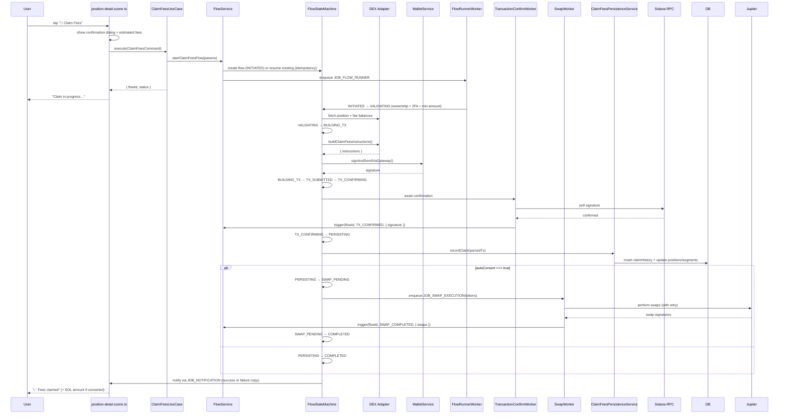

# Claim Fees Flow — Version 2.0 (Flow State Machine Architecture)

## Overview

The claim fees flow enables users to harvest accrued trading fees from any active DLMM position while preserving transaction safety guarantees. Version 2.0 introduces the Flow State Machine (FSM) architecture so every claim is idempotent, recoverable, and observable. The FSM also coordinates optional SOL auto-conversion, ensuring swaps happen after the claim succeeds and can be retried independently if the market moves.

## High-Level Flow (with State Machine)

## Wizard & Flow Step Breakdown

### User-Facing Steps

| Step | Scene | Description | Outputs |
|------|-------|-------------|---------|
| 1 | `position-detail.scene.ts` | User taps “💸 Claim Fees” | Current fee estimate fetched | 
| 2 | Confirmation dialog | Shows token breakdown, estimated SOL after conversion (if enabled) | `ClaimFeesCommand` payload |
| 3 | Optional 2FA | Prompt if user enabled 2FA for fee operations | Verified code |
| 4 | Progress updates | Message updated as flow advances | Flow status badges |

### Back-End Flow States

| State | Description | Success Transition | Error Handling |
|-------|-------------|--------------------|----------------|
| `INITIATED` | Flow created / resumed using idempotency key | `VALIDATING` | Fail if missing context |
| `VALIDATING` | Confirm ownership, minimum amounts, 2FA | `BUILDING_TX` | User errors surfaced immediately |
| `BUILDING_TX` | DEX adapter builds claim instructions | `TX_SUBMITTED` | Adapter errors fail the flow |
| `TX_SUBMITTED` | Transaction sent to blockchain | `TX_CONFIRMING` | RPC errors trigger retry |
| `TX_CONFIRMING` | Await on-chain confirmation | `PERSISTING` | Timeout → `FAILED` |
| `PERSISTING` | Persist claim history & update analytics | `SWAP_PENDING` (if auto-convert) or `COMPLETED` | DB errors retried (3 attempts) |
| `SWAP_PENDING` | Await SOL conversion swaps | `COMPLETED` | Swap retry with exponential backoff |
| `COMPLETED` | Final state (notification sent) | terminal | — |
| `FAILED` | Terminal failure state | terminal | Alerts + user-friendly copy |

## Error & Recovery Matrix

| Failure Point | Example Error | Classification | Recovery Strategy | User Messaging |
|---------------|---------------|----------------|-------------------|----------------|
| Validation | "Position already closed" | USER_ERROR | Fail fast | “Position is no longer active.” |
| Adapter build | "No claimable fees" | USER_ERROR | Fail fast | “No fees available above 0.5 USD.” |
| Transaction submit | `NETWORK_TIMEOUT` | TRANSIENT | Retry (up to 3) with exponential backoff | “Network busy, retrying…” |
| TX confirmation | `TransactionError: BlockhashNotFound` | TRANSIENT | Refresh blockhash + resubmit | Transparent status badge |
| Swap execution | `SlippageExceeded` | TRANSIENT | Retry swap with widened slippage window (configurable) | “Fees claimed; swap pending retry.” |
| Persistence | DB connection lost | SYSTEM_ERROR | Retry (3x) then raise alert | “Recorded after retry, no action needed.” |

> Detailed runbooks live at [`/docs/developer/troubleshooting.md`](../../../docs/developer/troubleshooting.md).

## Implementation Snapshot

### Presentation Layer (`position-detail.scene.ts`)
- Uses the shared `flowStatus` helpers to render progress badges (INITIATED → COMPLETED).
- Confirmation dialog includes token breakdown, USD valuation, and SOL estimate (if auto-convert).
- Calls `ClaimFeesUseCase` with an idempotency key seeded from `positionId` + `dex` + `claimIntent`.
- Subscribes to flow notifications to update the message once the claim completes or fails.

### Application Layer (`ClaimFeesUseCase`)
- Translates scene payload into `startClaimFeesFlow` invocation.
- Passes contextual ids (userId, walletId, positionId, autoConvert preference) to the FSM.
- Returns the `flowId` + initial status so the scene can poll or await notifications.
- No longer writes directly to `pendingTransactions`; all writes go through `FlowService`.

### Flow Definition (`claim-fees-flow.ts`)
- Defines explicit states described above, including optional SWAP branch.
- Injects strategy-specific validators (minimum USD threshold, SOL-only payouts, etc.).
- Encodes checkpoint structure with token amounts, signature list, and swap statuses.
- Emits telemetry events (`flow.claim_fees.step`) at each transition.

### Worker Layer
- **FlowRunnerWorker**: Executes synchronous steps (validation, build, persistence).
- **TransactionConfirmWorker**: Signals `TX_CONFIRMED` with parsed transfer data.
- **SwapWorker**: Performs post-claim conversions with retry + alerting on repeated failures.
- **FlowCleanupWorker**: Marks flows `FAILED_TIMEOUT` if `flow_expires_at` elapsed (default 12 min).

### Persistence & Analytics
- `claimFeesPersistenceService.recordClaim` writes `claimHistory`, updates position fee aggregates, and inserts a snapshot capturing post-claim balances and USD totals.
- Automatically invalidates portfolio + position caches.
- Emits structured logs with `claimId`, `flowId`, `positionId`, `autoConvert`, and final amounts.

## Transaction Safety Guarantees

- **Idempotent Key**: `CLAIM_FEES:{userId}:{positionId}` prevents duplicate claims.
- **Checkpoint Data**: Stores `signature`, `claimedTokens`, `swapStatus`, ensuring safe resumption.
- **Retry Policies**: Adapter + RPC + swap layers respect exponential backoff with max attempts.
- **2FA Enforcement**: If enabled, `VALIDATING` state requires 2FA code before proceeding.
- **Graceful Degradation**: If swaps fail repeatedly, flow completes with original tokens and surfaces actionable instruction to user.

## Known Issues & Open Work

| ID | Severity | Status | Description | Planned Fix |
|----|----------|--------|-------------|-------------|
| CF-01 | ✅ | Resolved | ~~No idempotency in ClaimFeesUseCase~~ | Flow FSM rollout |
| CF-02 | 🟠 | Pending | Swap failures surfaced via logs only (user needs retry UX) | Scene update + retry CTA (Phase 2) |
| CF-03 | ✅ | Resolved | ~~Missing confirmation dialog~~ | Added in v2 wizard |
| CF-04 | 🟠 | Pending | Estimated vs actual fees mismatch not reconciled | Persist both values & send delta (Phase 3) |
| CF-05 | 🟠 | In Progress | Configurable payout token (keep native tokens vs SOL) | Feature flag (`claim.keepNative`) |
| CF-06 | 🟡 | Pending | Minimum claim threshold configurable per pool | Add strategy hooks (Phase 3) |
| CF-07 | 🟢 | Planned | Instrumentation for fee claim metrics | Add `flow_claim_fees_*` metrics (Phase 2) |

> Legend: ✅ Resolved · 🟠 High · 🟡 Medium · 🟢 Low

## Observability & Telemetry

- **Metrics**: `flow_claim_fees_duration_seconds`, `flow_claim_fees_failed_total`, `swap_retry_total`.
- **Logs**: Structured Pino logs keyed by `flowId`, `claimId`, `positionId`, `autoConvert`.
- **Dashboards**: Flow panel tracks success/failure, swap latency, and retry counts.
- **Alerts**:
  - Claim failure rate > 10% (PagerDuty)
  - Swap retries > 3 per claim (Slack warning)
  - Stale claims (`flow_state = TX_CONFIRMING` > 5 min) (PagerDuty)

## Next Steps

1. **Complete Auto-Convert UX** – Provide user-facing retry + toggle for swap preference.
2. **Delta Reporting** – Surface estimated vs actual fee amounts in Telegram notification.
3. **Metrics Rollout** – Wire `flow_claim_fees_*` metrics into Grafana dashboards.
4. **Support Runbook Update** – Document manual recovery for swap failures in `/docs/developer/troubleshooting.md`.
5. **Unit & Integration Tests** – Expand coverage for swap retry logic and checkpoint serialization.

## References

- [`apps/bot/src/application/position/claim-fees.use-case.ts`](../../src/application/position/claim-fees.use-case.ts)
- [`apps/bot/src/services/flows/claim-fees-flow.ts`](../../src/services/flows/claim-fees-flow.ts)
- [`apps/bot/src/infrastructure/jobs/workers/flow-runner.worker.ts`](../../src/infrastructure/jobs/workers/flow-runner.worker.ts)
- [`apps/bot/src/infrastructure/jobs/workers/transaction-confirm.worker.ts`](../../src/infrastructure/jobs/workers/transaction-confirm.worker.ts)
- [`apps/bot/src/infrastructure/jobs/workers/swap-execution.worker.ts`](../../src/infrastructure/jobs/workers/swap-execution.worker.ts)
- [`apps/bot/src/services/claim-fees-persistence.service.ts`](../../src/services/claim-fees-persistence.service.ts)
- [Flow State Machine Guide](../../../docs/developer/flow-state-machine-guide.md)
- [Troubleshooting Manual – Claims](../../../docs/developer/troubleshooting.md#transaction-stuck-in-pending-state)
