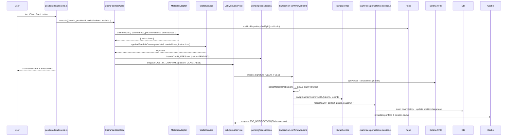

# Claim Fees Flow — Current State Audit (Jan 2025)

## Overview

The claim fees flow allows users to harvest accrued trading fees from an active DLMM position. Claimed tokens are automatically converted to SOL to simplify custody. This document reflects the **current implementation** and highlights technical debt that must be addressed in Phase 2 refactorings.

## High-Level Flow

## Implementation Snapshot

### Presentation Layer (`position-detail.scene.ts`)
- **Confirmation Dialog:** Missing explicit confirmation step (see **Issue CF-03** below).
- Invokes `ClaimFeesUseCase` with user/wallet context.
- Displays loading state until use case resolves.
- Updates message with success/failure copy and optionally refreshes position card.

### Application Layer (`ClaimFeesUseCase`)
- **Validation:** Verifies `userId`, `positionId`, `walletAddress` presence and ownership.
- **Adapter Invocation:** Calls `IDexAdapter.claimFeesIxs` to build DEX-specific instructions.
- **Transaction Submission:** Uses `WalletService.signAndSendViaGateway` for Sanctum Gateway or Jito fallback.
- **Pending Transaction:** Inserts record with `operationType = CLAIM_FEES` and `ClaimFeesContext` metadata:
  - `userId`, `positionId`, `positionAddress`, `poolAddress`, `dex`
  - Token metadata (`tokenA`, `tokenB`)
  - `convertToSol = true` (hardcoded)
  - `estimatedFeesUsd` (pre-fetched from adapter)
- **Job Scheduling:** Enqueues `JOB_TX_CONFIRM` with 500 ms delay.

### Worker Layer (`transaction-confirm.worker.ts`)
- **Confirmation Polling:** Monitors signature status via Solana RPC.
- **Instruction Parsing:** `parseMeteoraInstructions` identifies claim-related transfers and aggregates token amounts.
- **Pricing:** Fetches USD prices for token A, token B, and SOL via `TokenPriceService`.
- **SOL Conversion:** `swapClaimedTokensToSOL` executes Jupiter orders for each non-SOL token. If swap fails, logs error but continues using estimated USD values.
- **Snapshot Fetching:** Attempts to fetch on-chain position state via adapter to populate a post-claim snapshot.
- **Persistence:** `claimFeesPersistenceService.recordClaim` performs a DB transaction:
  - Inserts `claimHistory` row (`type = manual`)
  - Updates `positions.totalFeesClaimedUSD` and current segment's `feesClaimedUSD`
  - Inserts `positionSnapshots` record documenting post-claim state and recalculated PnL
- **Notifications & Caching:** Enqueues `JOB_NOTIFICATION` summarising the claim (USD + SOL amounts) and invalidates portfolio/position caches.

## Known Issues & Technical Debt

| ID | Severity | Area | Description | Impact | Linked Work |
|----|----------|------|-------------|--------|-------------|
| CF-01 | 🔴 Critical | Application | **No idempotency** in `ClaimFeesUseCase`. Repeat submissions could attempt duplicate claims. | While blockchain prevents double-claims, pending TX table may become inconsistent. | ADR-004, Enhancement Spec §Phase 1 |
| CF-02 | 🟠 High | Worker | **Swap failures are logged but not surfaced to user.** If SOL conversion fails, user doesn't know their fees are stuck in token form. | User confusion; support burden. | ADR-001, Enhancement Spec §Phase 2 |
| CF-03 | 🟠 High | Scene | **No explicit confirmation dialog.** User taps button and claim is immediately submitted. | Accidental claims possible; UX mismatch with PRD guidelines. | Enhancement Spec §Phase 2 |
| CF-04 | 🟠 High | Worker | **Estimated vs actual fees mismatch not reconciled.** Estimated USD in context may differ from parsed transaction amounts. | Inaccurate notifications and analytics. | Enhancement Spec §Phase 3 |
| CF-05 | 🟠 High | Adapter | **Hard-coded `convertToSol = true`** in use case. No flexibility to keep tokens in native form. | Violates PRD preference for user control. | Enhancement Spec §Phase 2 |
| CF-06 | 🟡 Medium | Error Handling | Mixed use of `console.error`, `logger.error`, generic errors. | Poor observability; bad UX. | ADR-001 |
| CF-07 | 🟡 Medium | Validation | No check for minimum claimable amount. Users can pay gas to claim $0.01. | Wasted gas; negative UX. | Enhancement Spec §Phase 3 |
| CF-08 | 🟡 Medium | Notifications | Success message uses static copy; no error state handling. | Inconsistent user messaging. | Enhancement Spec §Phase 5 |
| CF-09 | 🟢 Low | Metrics | No instrumentation for claim success rate or fee amounts. | Hard to validate PRD metrics (e.g., zero lost funds). | Enhancement Spec §Phase 5 |

> **Legend:** 🔴 Critical · 🟠 High · 🟡 Medium · 🟢 Low

## Observability & Telemetry

- Logs use `logger.info/warn/error` but lack structured fields (e.g., `claimId`, `estimatedFeesUsd`).
- No correlation IDs for tracing claim → swap → notification pipeline.
- Pending transactions table contains limited context; no state transition history.
- Swap failures logged in worker but not tracked as metrics.

## Next Steps (from Enhancement Specification)

1. **Idempotent Command Wrapper** for claim fees (ADR-004 — Phase 1).
2. **Domain Error Classes** + user-friendly messages (ADR-001).
3. **Add Confirmation Dialog** in scene with fee estimate (Enhancement Spec §Phase 2).
4. **Configurable Payout Token** (allow users to keep fees as tokens or convert to SOL).
5. **Reconcile Estimated vs Actual Fees** in worker and adjust notification copy.
6. **Minimum Claim Threshold** validation (e.g., $1 minimum to avoid wasted gas).
7. **Surface Swap Failures** to user with actionable error message and retry button.
8. **Add Metrics:** claim success rate, average fee amount, swap success rate.

## References

- [`apps/bot/src/presentation/scenes/position-detail.scene.ts`](../../src/presentation/scenes/position-detail.scene.ts)
- [`apps/bot/src/application/position/claim-fees.use-case.ts`](../../src/application/position/claim-fees.use-case.ts)
- [`apps/bot/src/infrastructure/jobs/workers/transaction-confirm.worker.ts`](../../src/infrastructure/jobs/workers/transaction-confirm.worker.ts)
- [`apps/bot/src/services/claim-fees-persistence.service.ts`](../../src/services/claim-fees-persistence.service.ts)
- [Enhancement Specification](./enhancement-specification.md)
- [ADR-001](../adrs/001-error-handling-classification.md), [ADR-004](../adrs/004-transaction-safety-idempotency.md)
