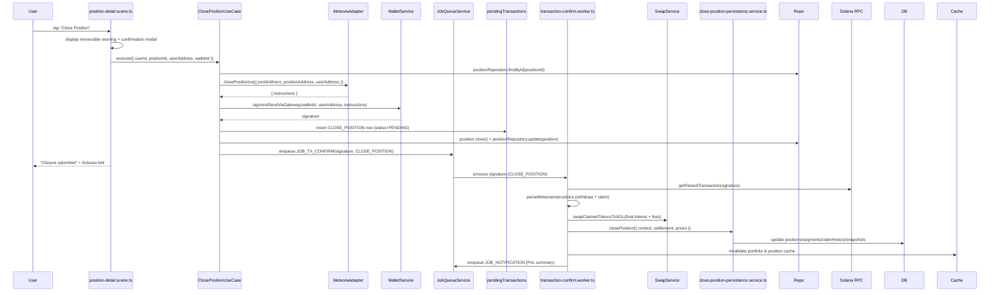

# Close Position Flow — Current State Audit (Jan 2025)

## Overview

Closing a Meteora DLMM position withdraws all liquidity, harvests remaining fees, converts proceeds to SOL, and records realised PnL. The flow spans user confirmation, adapter orchestration, background processing, and persistence updates. This document captures the **current implementation** and the technical debt observed during the baseline audit.

## High-Level Flow

## Implementation Snapshot

### Presentation Layer (`position-detail.scene.ts`)
- Presents irreversible warning and requires explicit confirmation.
- Sends command to `ClosePositionUseCase` with optional `closureReason` (default `user_close`).
- Displays submission status and refreshes position card post-confirmation.

### Application Layer (`ClosePositionUseCase`)
- Validates `userId`, `positionId`, `userAddress`, and ownership.
- Fetches position from repository; ensures user owns the position.
- Calls `IDexAdapter.closePositionIxs` to build remove-liquidity + claim instructions.
- Submits transaction via `WalletService.signAndSendViaGateway`.
- Persists pending transaction metadata (`PositionClosureContext`) including token metadata and closure reason.
- Optimistically marks domain entity as `CLOSED` and persists immediately.
- Enqueues `JOB_TX_CONFIRM` with 500 ms delay.
- Invalidates portfolio and position caches (best-effort).

### Worker Layer (`transaction-confirm.worker.ts`)
- Polls Solana RPC for signature confirmation.
- Parses Meteora instructions (`open/remove`, `claim`) to derive:
  - `finalTokenAAmount`, `finalTokenBAmount`
  - `claimedFeesTokenA/B`
  - Raw lamport amounts
- Converts all tokens to SOL using `SwapService`. Failures trigger retries; persistent failures leave tokens in native form (no UI feedback).
- `closePositionPersistenceService.closePosition` transactionally:
  - Inserts `claimHistory` row if fees harvested during close
  - Closes current segment and records realised PnL
  - Updates `positions` row with final valuations and status
  - Inserts closure snapshot
- Enqueues notification summarising realised PnL and refunds.

## Known Issues & Technical Debt

| ID | Severity | Area | Description | Impact | Linked Work |
|----|----------|------|-------------|--------|-------------|
| CL-01 | 🔴 Critical | Application | **No idempotency** in `ClosePositionUseCase`. Retries could attempt duplicate closes. | Risk of double-close calls; though blockchain may reject, pending state becomes corrupted. | ADR-004, Enhancement Spec §Phase 1 |
| CL-02 | 🔴 Critical | Worker | **Swap failure leaves funds in token form** with no user notification. | Users expect SOL; funds may remain illiquid, requiring manual support. | ADR-001, Enhancement Spec §Phase 2 |
| CL-03 | 🔴 Critical | State | **Optimistic status update to CLOSED** before confirmation. If transaction fails, position remains incorrectly closed in DB. | Stale/incorrect portfolio, broken follow-up flows. | ADR-003, Enhancement Spec §Phase 1 |
| CL-04 | 🟠 High | Validation | No pre-close validation (min liquidity, outstanding fees, pending transactions). | Potential to waste gas or conflict with concurrent operations. | Enhancement Spec §Phase 2 |
| CL-05 | 🟠 High | Worker | **No rollback/compensation** when close fails after optimistic update. | Manual intervention required; state inconsistencies accumulate. | ADR-003, Enhancement Spec §Phase 1 |
| CL-06 | 🟠 High | Error Handling | Mixed logging, generic error messages to users. | Hard to diagnose failures; users confused. | ADR-001 |
| CL-07 | 🟠 High | Notification | PnL summary built on best-effort data; if price fetch fails, message may be misleading. | User trust impact; inaccurate analytics. | Enhancement Spec §Phase 3 |
| CL-08 | 🟡 Medium | Swap | `MINIMAL_SOL_AMOUNT_IN_LAMPORTS` hardcoded; reserves may be insufficient for gas in volatile periods. | Transaction may fail due to insufficient SOL for fees. | Enhancement Spec §Phase 2 |
| CL-09 | 🟡 Medium | Metrics | No instrumentation for close success rate or PnL distribution. | Can't validate PRD metrics (transaction success ≥95%). | Enhancement Spec §Phase 5 |
| CL-10 | 🟢 Low | UX | No pre-close summary of expected token amounts or estimated SOL. | Users act without visibility; inconsistent with PRD guidelines. | Enhancement Spec §Phase 2 |

> **Legend:** 🔴 Critical · 🟠 High · 🟡 Medium · 🟢 Low

## Observability & Telemetry

- Logs missing structured metadata (e.g., `closureReason`, `finalValueUSD`).
- No correlation IDs from close → worker → notification pipeline.
- Pending transaction table lacks stage tracking (submitted vs confirmed vs persisted).
- Swap retries logged but not exposed as metrics.

## Next Steps (from Enhancement Specification)

1. **Idempotent Command Wrapper** for close position (ADR-004 — Phase 1).
2. **State Machine** to manage optimistic updates and ensure rollbacks on failure (ADR-003).
3. **Domain Error Classes** to improve user messaging and retry semantics (ADR-001).
4. **Pre-Close Validation** (minimum liquidity, outstanding fees, pending operations).
5. **Swap Reliability Improvements** with user feedback if conversion fails.
6. **Compensation Logic:** If swap or persistence fails, notify user and retain tokens safely.
7. **Pre-Close Summary UI** with estimated SOL/value breakdown.
8. **Metrics:** close success rate, average PnL, swap failure counts.

## References

- [`apps/bot/src/presentation/scenes/position-detail.scene.ts`](../../src/presentation/scenes/position-detail.scene.ts)
- [`apps/bot/src/application/position/close-position.use-case.ts`](../../src/application/position/close-position.use-case.ts)
- [`apps/bot/src/infrastructure/jobs/workers/transaction-confirm.worker.ts`](../../src/infrastructure/jobs/workers/transaction-confirm.worker.ts)
- [`apps/bot/src/services/close-position-persistence.service.ts`](../../src/services/close-position-persistence.service.ts)
- [Enhancement Specification](./enhancement-specification.md)
- [ADR-001](../adrs/001-error-handling-classification.md), [ADR-003](../adrs/003-state-machine-position-flow.md), [ADR-004](../adrs/004-transaction-safety-idempotency.md)
