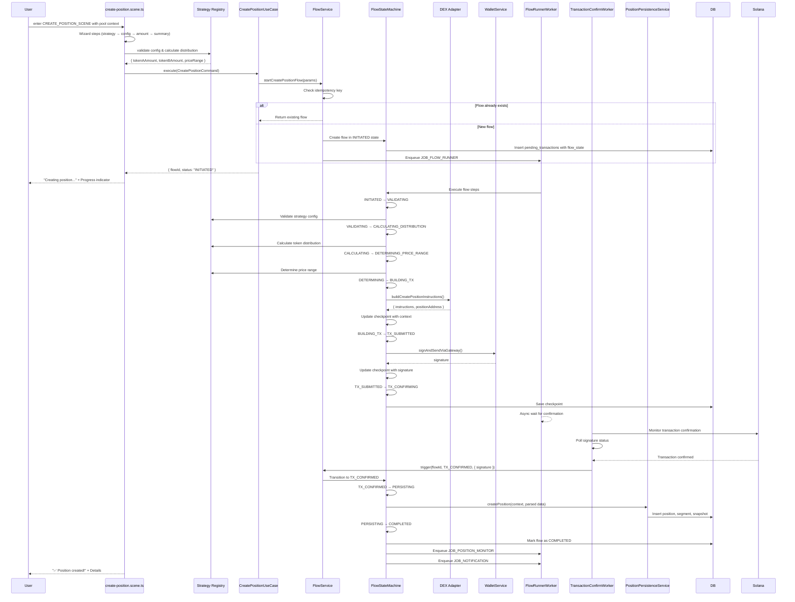

# Position Creation Flow — Version 2.0 (Flow State Machine Architecture)

## Overview

The position creation experience guides a user from pool selection to an active Meteora/Saros DLMM position. The flow combines a multi-step Telegram wizard, application-layer orchestration, Flow State Machine for transaction safety, BullMQ-powered background jobs, and persistence services that materialise on-chain state into the database. This document reflects the **Version 2.0 implementation** with Flow State Machine architecture providing idempotency, recovery, and observability guarantees.

## High-Level Flow (with State Machine)

> **Note:** The Flow State Machine provides idempotency, recovery, and error handling throughout. If any step fails, the flow can be resumed from the last checkpoint.

## Implementation Snapshot

### Presentation Layer (`create-position.scene.ts`)
- Uses a Telegraf wizard (`Scenes.WizardScene`) with seven concrete steps.
- Relies on a mutable `WizardState` object stored in `ctx.scene.state`.
- Currently only the **balanced (SOL auto-convert)** path is functional; single-sided steps have FIXMEs.
- Calls into shared formatters (`generateProgressMessage`, `generatePositionSummary`).
- Fetches on-chain context via `GetPoolDetailsUseCase`, `GetBalanceUseCase`, `GetPriceRangeUseCase`, `CalculateBalancedDistributionUseCase`.
- Summary step calculates token split and price range before sending the command to the use case.

### Application Layer (`CreatePositionUseCase`)
- Validates wallet/pool addresses and non-zero token amounts.
- Invokes `IDexAdapter.createPositionIxs` to build Meteora instructions.
- Submits transactions through `WalletService.signAndSendViaGateway`.
- Persists metadata in `pendingTransactions` (`operationType = CREATE_POSITION`).
- Enqueues `JOB_TX_CONFIRM` (500 ms delay) and invalidates portfolio cache.
- Includes `handleSolAutoConvert` branch that orchestrates SOL→token swaps (two separate jobs) and stores a synthetic pending entry keyed by `positionCreationId`.

### Worker Layer (`transaction-confirm.worker.ts`)
- Polls Solana RPC for signature confirmation.
- Parses Meteora instructions via `parseMeteoraInstructions` (expects `open` + `add`).
- Derives actual token amounts and USD valuations using `TokenPriceService`.
- Calls `positionPersistenceService.createPosition` to persist entities:
  - `positions`
  - `positionSegments`
  - `positionSnapshots`
- Enqueues monitoring and notification jobs if applicable.

### Infrastructure & Persistence
- `JobQueueService` initialises queues/workers (BullMQ) with exponential backoff.
- `pendingTransactions` stores command metadata for recovery/retries.
- `positionPersistenceService` wraps SQL inserts/updates and ensures snapshots.

## Known Issues & Technical Debt

| ID | Severity | Area | Description | Impact | Linked Work |
|----|----------|------|-------------|--------|-------------|
| CP-01 | 🔴 Critical | Application | **No idempotency** in `CreatePositionUseCase`. Retries or duplicate submits can create multiple positions. | Risk of duplicate positions and double-spend. | ADR-004, Enhancement Spec §Phase 1 |
| CP-02 | 🔴 Critical | Worker | **Manual transaction parsing** relies on instruction names and may miss edge cases (e.g., Meteora instruction updates). | Potentially incorrect token accounting, especially if Meteora updates their contracts. | Enhancement Spec §Phase 3 |
| CP-03 | 🔴 Critical | SOL Auto-Convert | `handleSolAutoConvert` enqueues swap jobs but never resumes creation once swaps settle. `JOB_SWAP_EXECUTION` worker is stubbed. | Feature unusable; pending transactions remain PENDING. | Enhancement Spec §Phase 2 |
| CP-04 | 🟠 High | Scene | Single-sided branch has TODO/FIXME at lines 227–244; deposit source selection uses placeholder copy and missing validation. | UX dead-end; violates PRD requirements. | ADR-002, Enhancement Spec §Phase 2 |
| CP-05 | 🟠 High | Error Handling | Mixed use of `console.error`, `logger.error`, generic errors; no user-friendly message mapping. | Poor observability; bad UX when failures occur. | ADR-001 |
| CP-06 | 🟠 High | Validation | No transaction simulation prior to submission. | Users encounter on-chain failures late, harming confidence. | Enhancement Spec §Phase 1 |
| CP-07 | 🟠 High | Strategy | Strategy selection is cosmetic; logic identical for all options. | Cannot introduce curve/bid-ask behaviors; analytics inaccurate. | ADR-002 |
| CP-08 | 🟠 High | State Mgmt | Wizard relies on branching `ctx.wizard.next()` calls with implicit knowledge of previous steps. | Hard to maintain; edge cases may leak. | ADR-003 |
| CP-09 | 🟡 Medium | Cache | Cache invalidation occurs only for portfolio; single-position cache invalidation missing. | Stale UI when user opens position details immediately. | Enhancement Spec §Phase 1 |
| CP-10 | 🟡 Medium | Notifications | Success message uses static copy; no templating or error states. | Inconsistent user messaging; no retries on failure. | Enhancement Spec §Phase 5 |
| CP-11 | 🟡 Medium | Preferences | Auto-rebalance default toggled in wizard but not persisted per strategy. | Misalignment with future strategy features. | ADR-002 |
| CP-12 | 🟢 Low | Metrics | Flow lacks dedicated metrics (duration, drop-off per step). | Hard to monitor success metrics from PRD. | Enhancement Spec §Phase 5 |

> **Legend:** 🔴 Critical · 🟠 High · 🟡 Medium · 🟢 Low

## Observability & Telemetry

- Logs use `logger.info/error` but lack structured fields (e.g., `idempotencyKey`, `strategy`).
- No metrics for wizard drop-off or transaction durations.
- Pending transactions table contains limited context; no state transition history.
- Notification pipeline lacks correlation IDs for tracing.

## Next Steps (from Enhancement Specification)

1. **Idempotent Command Wrapper** for create position (ADR-004 — Phase 1).
2. **Domain Error Classes** + user-friendly messages (ADR-001).
3. **Strategy Registry** to encapsulate Spot/Curve/Bid-Ask differences (ADR-002).
4. **State Machine** driven wizard to simplify branching and enable analytics (ADR-003).
5. **Transaction Simulation** before wallet submission; persist simulator results for support.
6. **Complete Single-Sided Deposits** including token selection, deposit source, price coverage, and summary copy.
7. **Finalize SOL Auto-Convert Pipeline** (swap completion → create position resume) with proper ordering guarantees.
8. **Add Metrics**: step completion rates, create success vs failure reasons, RPC duration.

## References

- [`apps/bot/src/presentation/scenes/create-position.scene.ts`](../../src/presentation/scenes/create-position.scene.ts)
- [`apps/bot/src/application/position/create-position.use-case.ts`](../../src/application/position/create-position.use-case.ts)
- [`apps/bot/src/infrastructure/jobs/workers/transaction-confirm.worker.ts`](../../src/infrastructure/jobs/workers/transaction-confirm.worker.ts)
- [`apps/bot/src/services/position-persistence.service.ts`](../../src/services/position-persistence.service.ts)
- [Enhancement Specification](./enhancement-specification.md)
- [ADR-001](../adrs/001-error-handling-classification.md), [ADR-002](../adrs/002-lp-strategy-abstraction.md), [ADR-003](../adrs/003-state-machine-position-flow.md), [ADR-004](../adrs/004-transaction-safety-idempotency.md)
