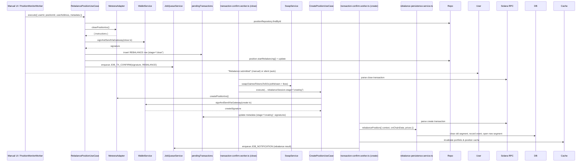

# Rebalance Flow — Current State Audit (Jan 2025)

## Overview

Rebalancing a Meteora DLMM position re-centres liquidity distribution when the market price exits the configured range, maximising fee capture. The flow is a coordinated close → convert → recreate sequence managed by `RebalanceSessionMetadata` and involves two separate blockchain transactions. Rebalancing can be user-triggered or automated via `JOB_POSITION_MONITOR`. This document outlines the **current implementation** and its structural weaknesses that require Phase 2 attention.

## High-Level Flow

## Implementation Snapshot

### Manual Trigger Path (`position-detail.scene.ts` → `RebalancePositionUseCase`)
- Scene presents a rebalance button for active positions that supports manual confirmation.
- User approves and scene invokes `RebalancePositionUseCase` with optional `metadata` (e.g., custom strategy or rangeInterval).
- Use case validates ownership, fetches user wallet info, and performs close transaction.

### Automated Trigger Path (`PositionMonitorWorker` → `JOB_REBALANCE` → `RebalancePositionUseCase`)
- `PositionMonitorWorker` polls positions via `GetPositionUseCase`.
- Checks if position is out of range and auto-rebalance enabled.
- Enqueues `JOB_REBALANCE` with `reason = "out_of_range_auto"` and delegates to the same use case.

### Application Layer (`RebalancePositionUseCase`)
- Validates `userId`, `positionId`, `userAddress`.
- Calls `IDexAdapter.closePositionIxs` to build the close transaction.
- Submits via `WalletService.signAndSendViaGateway`.
- Persists pending transaction with `operationType = REBALANCE` and `RebalanceSessionMetadata` (stores session ID, trigger reason, strategy, token metadata, and old position address).
- Optimistically marks position as `REBALANCING`.
- Enqueues `JOB_TX_CONFIRM` for the close signature.
- Invalidates caches for portfolio and position.

### Worker Layer — Close Stage (`transaction-confirm.worker.ts`)
- Polls Solana RPC for close signature confirmation.
- Parses instructions and extracts withdrawn liquidity + claimed fees.
- Converts **all** tokens to SOL via `SwapService` (ensures uniform SOL budget for recreation).
- Splits usable SOL equally for token A and token B purchase (after reserving minimal SOL for gas).
- Executes SOL→token swaps via `SwapService` (handles native SOL vs wrapped SOL edge cases).
- Calls `CreatePositionUseCase.execute` with `rebalanceSession.stage = "creating"` and rehydrated token amounts.
- `CreatePositionUseCase` yields a second signature and updates the pending transaction metadata with conversion details (two-phase correlation).

### Worker Layer — Create Stage (`transaction-confirm.worker.ts`)
- When the create signature confirms, worker calls `rebalancePersistenceService.rebalancePosition`:
  - Closes the old segment and records realised PnL + fees collected during rebalance.
  - Inserts a new segment with the recreated position's initial value.
  - Stores a `rebalanceEvents` row capturing conversion data.
  - Updates the main `positions` row (new address, new segment number, totals).
  - Inserts a snapshot documenting the new baseline.
- Invalidates portfolio and position caches.
- Enqueues notification describing the trigger and net effect.

## Known Issues & Technical Debt

| ID | Severity | Area | Description | Impact | Linked Work |
|----|----------|------|-------------|--------|-------------|
| RB-01 | 🔴 Critical | Multi-Step | **No atomicity guarantee** for close → create sequence. If create fails, user ends with closed position and no new position. | User loses liquidity exposure; manual intervention required. | ADR-003, ADR-004, Enhancement Spec §Phase 3 |
| RB-02 | 🔴 Critical | SOL Conversion | **All-or-nothing swap failures.** If SOL conversion fails, worker crashes and funds remain in token form. | User funds stuck; no way to resume flow or refund. | ADR-001, Enhancement Spec §Phase 3 |
| RB-03 | 🔴 Critical | Application | **No idempotency** in `RebalancePositionUseCase`. Retries can double-close or double-create. | Risk of partial rebalances or duplicate positions. | ADR-004, Enhancement Spec §Phase 1 |
| RB-04 | 🔴 Critical | State | **Optimistic REBALANCING status** leaves position stuck if flow fails. | State inconsistency; UI shows "rebalancing" forever. | ADR-003, Enhancement Spec §Phase 1 |
| RB-05 | 🟠 High | Recovery | **RebalanceSessionMetadata not durable.** If worker crashes after close, hard to resume create stage. | Manual recovery; risk of partial rebalances. | ADR-004, Enhancement Spec §Phase 3 |
| RB-06 | 🟠 High | Monitoring | **Auto-rebalance threshold hardcoded** in `PositionMonitorWorker`; doesn't respect user preferences. | User expectations violated; unexpected rebalances. | Enhancement Spec §Phase 3 |
| RB-07 | 🟠 High | Compensation | **No compensation/rollback logic** for failed create. User funds remain in SOL after close with no position. | Support burden; lost exposure for users. | ADR-003, Enhancement Spec §Phase 3 |
| RB-08 | 🟠 High | Error Handling | Mixed logging and generic error messages; no classification of transient vs permanent failures. | Poor observability; retries may exacerbate issues. | ADR-001 |
| RB-09 | 🟡 Medium | Swap Logic | SOL split logic (`halfAmount = netAmount / 2`) doesn't account for swap slippage asymmetries. | Imbalanced token amounts after swaps; recreation may fail. | Enhancement Spec §Phase 4 |
| RB-10 | 🟡 Medium | Metrics | No instrumentation for rebalance success rate, trigger frequency, or rebalance costs. | Can't validate PRD metrics; hard to optimise. | Enhancement Spec §Phase 5 |
| RB-11 | 🟡 Medium | Notification | Notification payload doesn't include net effect on liquidity or P&L impact. | Users confused about what happened. | Enhancement Spec §Phase 5 |
| RB-12 | 🟢 Low | Defaults | Hardcoded 10-bin range for new position; no strategy-specific range logic. | Limits effectiveness of rebalancing strategy. | ADR-002 |

> **Legend:** 🔴 Critical · 🟠 High · 🟡 Medium · 🟢 Low

## Observability & Telemetry

- No correlation ID from close → swap → create → notification pipeline.
- Pending transaction metadata lacks atomic stage tracking; partial updates to metadata prone to race conditions.
- Logs missing structured fields (e.g., `sessionId`, `trigger`, `netSOLUsed`).
- Swap retries logged but not exposed in dashboards.

## Next Steps (from Enhancement Specification)

1. **Rebalance State Machine** formalising close → creating → complete stages with guards and rollback logic (ADR-003).
2. **Rebalance Coordinator** implementing idempotency and compensation patterns (ADR-004).
3. **Transaction Simulation** for both close and create stages to catch failures early.
4. **Compensation Logic:** If create fails, refund SOL to user wallet and notify of partial rebalance.
5. **Durable Session Persistence:** Store session in dedicated table (`rebalanceSessions`) to allow resumption after crashes.
6. **Respect User Preferences:** Auto-rebalance threshold, strategy, bin range from user settings or position metadata.
7. **Metrics:** rebalance success rate, duration (close confirmation to create confirmation), conversion costs.
8. **Enhanced Swap Coordination:** Use slippage-aware token split logic instead of naive 50/50 split.
9. **Pre-Rebalance Simulation UI:** Show estimated new range and costs before confirmation.

## References

- [`apps/bot/src/presentation/scenes/position-detail.scene.ts`](../../src/presentation/scenes/position-detail.scene.ts)
- [`apps/bot/src/application/position/rebalance-position.use-case.ts`](../../src/application/position/rebalance-position.use-case.ts)
- [`apps/bot/src/infrastructure/jobs/workers/transaction-confirm.worker.ts`](../../src/infrastructure/jobs/workers/transaction-confirm.worker.ts)
- [`apps/bot/src/infrastructure/jobs/workers/position-monitor.worker.ts`](../../src/infrastructure/jobs/workers/position-monitor.worker.ts)
- [`apps/bot/src/services/rebalance-persistence.service.ts`](../../src/services/rebalance-persistence.service.ts)
- [Enhancement Specification](./enhancement-specification.md)
- [ADR-001](../adrs/001-error-handling-classification.md), [ADR-003](../adrs/003-state-machine-position-flow.md), [ADR-004](../adrs/004-transaction-safety-idempotency.md)
