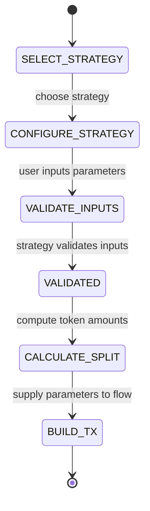

# Adding LP Strategies Guide

## Table of Contents
- [Overview](#overview)
- [Strategy Architecture](#strategy-architecture)
- [Abstractions & Interfaces](#abstractions--interfaces)
- [Implementation Checklist](#implementation-checklist)
- [Strategy Types](#strategy-types)
- [State Machine Integration](#state-machine-integration)
- [Testing Strategies](#testing-strategies)
- [Examples](#examples)
- [Troubleshooting](#troubleshooting)

## Overview

This guide explains how to add new Liquidity Provision (LP) strategies to the Meteora Liquidity Bot. Strategies encapsulate price range selection, token distribution, and rebalancing behavior for different risk profiles and DEX mechanics.

### Why Strategies Matter

Strategies help users provide liquidity effectively by:
- Defining the price range where liquidity is deployed
- Determining token ratios and deposit amounts
- Tailoring to market conditions and user risk tolerance
- Automating rebalancing and fee harvesting logic

### Current Strategies

| Strategy | Description | Use Case |
|----------|-------------|----------|
| **Spot (Balanced)** | Even liquidity around current price | Stable pairs, beginners |
| **Curve (Concentrated)** | Tight range around current price | Experienced users, high volume pairs |
| **Bid-Ask (Directional)** | Liquidity on one side | Directional bets, specific tokens |

## Strategy Architecture

Strategies are implemented using a registry pattern with dependency injection. Each strategy provides:

1. **Metadata**: Name, description, risk level
2. **Configuration**: Parameters required (e.g., price range, coverage)
3. **Validation**: Ensures input parameters are valid
4. **Calculations**: Determines token split and price range
5. **Instructions**: Provides context for transaction builders
6. **Rebalancing**: Defines how to reposition liquidity when out of range

### Flow Integration

Strategies are integrated with the flow state machine at:
- **Validation Stage**: Ensure user inputs align with strategy requirements
- **Building Stage**: Provide parameters for transaction builders
- **Persistence Stage**: Store strategy metadata for future use
- **Rebalance Stage**: Determine new parameters when rebalancing



## Abstractions & Interfaces

### Strategy Registry

```typescript
// src/services/strategies/strategy-registry.ts

export interface StrategyRegistry {
  register(strategy: LiquidityStrategy): void;
  get(strategyId: StrategyId): LiquidityStrategy;
  list(): LiquidityStrategy[];
}
```

### Strategy Interface

```typescript
// src/services/strategies/types.ts

export interface LiquidityStrategy {
  id: StrategyId;
  name: string;
  description: string;
  riskLevel: 'low' | 'medium' | 'high';
  supportedDexes: DexType[];
  
  /**
   * Default configuration for this strategy
   */
  defaultConfig(): StrategyConfig;
  
  /**
   * Validate user-provided configuration
   */
  validate(config: StrategyConfig, context: StrategyContext): ValidationResult;
  
  /**
   * Calculate token distribution based on config and current market data
   */
  calculateDistribution(
    config: StrategyConfig,
    context: StrategyContext
  ): DistributionResult;
  
  /**
   * Determine price range for this strategy
   */
  determinePriceRange(
    config: StrategyConfig,
    context: StrategyContext
  ): PriceRangeResult;
  
  /**
   * Provide instructions for automated rebalancing
   */
  getRebalancePlan(
    config: StrategyConfig,
    position: PositionSnapshot,
    marketData: MarketData
  ): RebalancePlan;
}
```

### Strategy Context

```typescript
export interface StrategyContext {
  userId: string;
  walletAddress: string;
  pool: UnifiedPool;
  marketPrice: number;
  tokenBalances: Record<string, TokenBalance>;
  historicalVolatility?: number;
  poolDepth?: number;
  dex: DexType;
}
```

### Strategy Configuration

```typescript
export interface StrategyConfig {
  coveragePercentage?: number;  // For Curve strategy
  priceRange?: {
    lower: number;
    upper: number;
  };
  allocation?: {
    tokenA: number; // percentage
    tokenB: number; // percentage
  };
  autoRebalance?: {
    enabled: boolean;
    thresholdPercentage?: number;
  };
}
```

## Implementation Checklist

### Phase 1: Planning
- [ ] Define strategy purpose and target users
- [ ] Determine required configuration inputs
- [ ] Understand market conditions this strategy is suited for
- [ ] Identify DEX limitations

### Phase 2: Implementation
- [ ] Create strategy class implementing `LiquidityStrategy`
- [ ] Register strategy in strategy registry
- [ ] Update presentation layer to collect config inputs
- [ ] Update use cases to handle strategy output

### Phase 3: Validation & Testing
- [ ] Add validation rules for strategy config
- [ ] Write unit tests for strategy logic
- [ ] Write integration tests for strategy flow
- [ ] Test with real pools and market data

### Phase 4: Documentation
- [ ] Update user-facing documentation
- [ ] Add strategy to position flows doc
- [ ] Create troubleshooting scenarios
- [ ] Update runbooks for rebalancing

## Strategy Types

### 1. Spot (Balanced) Strategy

- **ID**: `SPOT`
- **Description**: Balanced liquidity around current price
- **Use Case**: Stable pairs, low volatility markets
- **Configuration**:
  - `autoRebalance.enabled`: default true
  - `coveragePercentage`: default ±10%

**Price Range Calculation**:
```typescript
const lowerBound = marketPrice * (1 - coveragePercentage / 100);
const upperBound = marketPrice * (1 + coveragePercentage / 100);
```

**Token Distribution**:
```typescript
const totalValue = tokenAAmount * priceA + tokenBAmount * priceB;
const targetValue = totalValue / 2;
```

### 2. Curve Strategy

- **ID**: `CURVE`
- **Description**: Concentrated liquidity with narrow price range
- **Use Case**: High volume pairs, experienced users
- **Configuration**:
  - `coveragePercentage`: default ±5%
  - `autoRebalance.thresholdPercentage`: default 10%

**Tick Range Calculation**:
```typescript
const tickSpacing = pool.metadata.tickSpacing;
const ticks = Math.round(Math.log(price) / Math.log(1.0001));
const tickLower = Math.floor(ticks - (ticks * coveragePercentage / 100)) / tickSpacing * tickSpacing;
const tickUpper = Math.ceil(ticks + (ticks * coveragePercentage / 100)) / tickSpacing * tickSpacing;
```

### 3. Bid-Ask Strategy

- **ID**: `BID_ASK`
- **Description**: Liquidity on one side (buy or sell)
- **Use Case**: Directional bets, accumulating or distributing tokens
- **Configuration**:
  - `direction`: `'bid' | 'ask'`
  - `skewPercentage`: default 80%

**Allocation**:
```typescript
if (direction === 'bid') {
  allocation = { tokenA: 80, tokenB: 20 };
} else {
  allocation = { tokenA: 20, tokenB: 80 };
}
```

## State Machine Integration

Strategies integrate with the flow state machine in these states:

### VALIDATING State

```typescript
// create-position-flow.ts
{
  name: 'validate_strategy',
  state: CreatePositionState.VALIDATING_STRATEGY,
  handler: async (context) => {
    const strategy = strategyRegistry.get(context.strategyId);
    
    const validation = strategy.validate(context.strategyConfig, {
      userId: context.userId,
      walletAddress: context.walletAddress,
      pool: context.pool,
      marketPrice: context.marketPrice,
      tokenBalances: context.tokenBalances,
      dex: context.dex,
    });
    
    if (!validation.valid) {
      return {
        success: false,
        state: CreatePositionState.FAILED,
        error: validation.errors[0],
      };
    }
    
    return {
      success: true,
      state: CreatePositionState.CALCULATING_DISTRIBUTION,
      data: {
        strategyConfig: validation.sanitizedConfig,
      },
    };
  },
}
```

### CALCULATING_DISTRIBUTION State

```typescript
{
  name: 'calculate_distribution',
  state: CreatePositionState.CALCULATING_DISTRIBUTION,
  handler: async (context) => {
    const strategy = strategyRegistry.get(context.strategyId);
    
    const distribution = strategy.calculateDistribution(
      context.strategyConfig,
      {
        userId: context.userId,
        pool: context.pool,
        marketPrice: context.marketPrice,
        tokenBalances: context.tokenBalances,
        dex: context.dex,
      }
    );
    
    return {
      success: true,
      state: CreatePositionState.DETERMINING_PRICE_RANGE,
      data: {
        distribution,
      },
    };
  },
}
```

### DETERMINING_PRICE_RANGE State

```typescript
{
  name: 'determine_price_range',
  state: CreatePositionState.DETERMINING_PRICE_RANGE,
  handler: async (context) => {
    const strategy = strategyRegistry.get(context.strategyId);
    
    const priceRange = strategy.determinePriceRange(
      context.strategyConfig,
      {
        userId: context.userId,
        pool: context.pool,
        marketPrice: context.marketPrice,
        tokenBalances: context.tokenBalances,
        dex: context.dex,
      }
    );
    
    return {
      success: true,
      state: CreatePositionState.BUILDING_TX,
      data: {
        priceRange,
      },
    };
  },
}
```

## Testing Strategies

### Unit Tests

```typescript
// __tests__/strategies/spot.strategy.test.ts
import { describe, it, expect } from 'vitest';
import { SpotStrategy } from '@/services/strategies/spot.strategy';

describe('SpotStrategy', () => {
  const strategy = new SpotStrategy();
  
  const context = {
    userId: 'user123',
    walletAddress: 'wallet123',
    pool: mockPool,
    marketPrice: 100,
    tokenBalances: {
      SOL: { amount: '10', decimals: 9 },
      USDC: { amount: '1000', decimals: 6 },
    },
    dex: 'meteora',
  };
  
  it('should validate configuration', () => {
    const config = strategy.defaultConfig();
    const validation = strategy.validate(config, context);
    
    expect(validation.valid).toBe(true);
    expect(validation.errors).toHaveLength(0);
  });
  
  it('should calculate distribution', () => {
    const config = strategy.defaultConfig();
    const distribution = strategy.calculateDistribution(config, context);
    
    expect(distribution.tokenAAmount).toBeDefined();
    expect(distribution.tokenBAmount).toBeDefined();
    expect(distribution.slippageBps).toBeLessThanOrEqual(100);
  });
  
  it('should determine price range', () => {
    const config = strategy.defaultConfig();
    const priceRange = strategy.determinePriceRange(config, context);
    
    expect(priceRange.lowerBound).toBeLessThan(context.marketPrice);
    expect(priceRange.upperBound).toBeGreaterThan(context.marketPrice);
  });
});
```

### Integration Tests

```typescript
// __tests__/integration/strategies/create-position.test.ts
import { describe, it, expect, beforeEach } from 'vitest';
import { startCreatePositionFlow } from '@/services/flows/create-position-flow';
import { strategyRegistry } from '@/services/strategies/strategy-registry';

describe('Create Position Flow with Strategies', () => {
  beforeEach(() => {
    jest.clearAllMocks();
  });
  
  it('should complete flow with Spot strategy', async () => {
    const flow = await startCreatePositionFlow({
      userId: 'user123',
      walletAddress: 'wallet123',
      poolAddress: 'pool123',
      strategyId: 'SPOT',
      strategyConfig: strategyRegistry.get('SPOT').defaultConfig(),
    });
    
    await waitForFlowCompletion(flow.id);
    
    const result = await getFlowById(flow.id);
    expect(result.status).toBe('COMPLETED');
  });
  
  it('should reject invalid strategy config', async () => {
    const flow = await startCreatePositionFlow({
      userId: 'user123',
      walletAddress: 'wallet123',
      poolAddress: 'pool123',
      strategyId: 'CURVE',
      strategyConfig: {
        coveragePercentage: 200, // Invalid (too wide)
      },
    });
    
    await waitForFlowFailure(flow.id);
    
    const result = await getFlowById(flow.id);
    expect(result.status).toBe('FAILED');
    expect(result.error).toContain('Coverage percentage must be between 1% and 50%');
  });
});
```

### Property-Based Tests

Consider using property-based testing to validate strategy logic across many scenarios:

```typescript
import { fc } from 'fast-check';

it('should produce price ranges that include market price for Spot strategy', () => {
  fc.assert(
    fc.property(
      fc.float({ min: 0.01, max: 1000 }),
      fc.float({ min: 1, max: 50 }),
      (marketPrice, coverage) => {
        const strategy = new SpotStrategy();
        const context = { ...baseContext, marketPrice };
        const config = { coveragePercentage: coverage };
        
        const priceRange = strategy.determinePriceRange(config, context);
        
        return (
          priceRange.lowerBound <= marketPrice &&
          priceRange.upperBound >= marketPrice
        );
      }
    )
  );
});
```

## Examples

### Example 1: Spot Strategy Implementation

```typescript
// src/services/strategies/spot.strategy.ts
import { LiquidityStrategy } from './types';
import { StrategyId } from './strategy-registry';

export class SpotStrategy implements LiquidityStrategy {
  id: StrategyId.SPOT;
  name = 'Spot (Balanced)';
  description = 'Balanced liquidity around current price (recommended for most users).';
  riskLevel = 'low';
  supportedDexes = ['meteora', 'saros', 'orca', 'raydium'];
  
  defaultConfig() {
    return {
      coveragePercentage: 10, // ±10%
      autoRebalance: {
        enabled: true,
        thresholdPercentage: 20,
      },
    };
  }
  
  validate(config, context) {
    const errors = [];
    
    if (!config.coveragePercentage || config.coveragePercentage < 1 || config.coveragePercentage > 50) {
      errors.push('Coverage percentage must be between 1% and 50%.');
    }
    
    if (!context.tokenBalances[context.pool.tokenA.symbol] && !context.tokenBalances[context.pool.tokenB.symbol]) {
      errors.push('You must have balance in at least one token.');
    }
    
    return {
      valid: errors.length === 0,
      errors,
      sanitizedConfig: {
        ...this.defaultConfig(),
        ...config,
        coveragePercentage: Math.max(1, Math.min(50, config.coveragePercentage || 10)),
      },
    };
  }
  
  calculateDistribution(config, context) {
    const coverage = config.coveragePercentage || 10;
    const marketPrice = context.marketPrice;
    const totalValue = this.calculateTotalValue(context.tokenBalances, context.pool);
    
    // Balanced distribution: 50/50 split
    const targetValueTokenA = totalValue / 2;
    const targetValueTokenB = totalValue / 2;
    
    const tokenAPrice = context.pool.tokenA.priceUsd || marketPrice;
    const tokenBPrice = context.pool.tokenB.priceUsd || 1;
    
    const tokenAAmount = targetValueTokenA / tokenAPrice;
    const tokenBAmount = targetValueTokenB / tokenBPrice;
    
    return {
      tokenAAmount: tokenAAmount.toFixed(context.pool.tokenA.decimals),
      tokenBAmount: tokenBAmount.toFixed(context.pool.tokenB.decimals),
      coveragePercentage: coverage,
      slippageBps: 50, // 0.5%
    };
  }
  
  determinePriceRange(config, context) {
    const coverage = config.coveragePercentage || 10;
    const marketPrice = context.marketPrice;
    
    const lowerBound = marketPrice * (1 - coverage / 100);
    const upperBound = marketPrice * (1 + coverage / 100);
    
    return {
      lowerBound,
      upperBound,
      ticks: this.convertToTicks(lowerBound, upperBound, context.pool.metadata.tickSpacing),
    };
  }
  
  getRebalancePlan(config, position, marketData) {
    const coverage = config.coveragePercentage || 10;
    const threshold = config.autoRebalance?.thresholdPercentage || 20;
    
    return {
      triggerCondition: {
        type: 'price_deviation',
        threshold: threshold,
      },
      newRange: {
        lowerBound: marketData.currentPrice * (1 - coverage / 100),
        upperBound: marketData.currentPrice * (1 + coverage / 100),
      },
      actions: [
        { type: 'close_position', priority: 1 },
        { type: 'claim_fees', priority: 2 },
        { type: 'create_position', priority: 3 },
      ],
    };
  }
}
```

### Example 2: Custom Strategy Skeleton

```typescript
// src/services/strategies/my-new.strategy.ts
import { LiquidityStrategy } from './types';
import { StrategyId } from './strategy-registry';

export class YieldMaxStrategy implements LiquidityStrategy {
  id = StrategyId.YIELD_MAX;
  name = 'Yield Max';
  description = 'Aggressive strategy targeting high fee yields with dynamic range adjustments.';
  riskLevel = 'high';
  supportedDexes = ['meteora', 'saros'];
  
  defaultConfig() {
    return {
      coveragePercentage: 3, // Very narrow range
      autoRebalance: {
        enabled: true,
        thresholdPercentage: 5, // Tight threshold
      },
      impermanentLossProtection: {
        enabled: true,
        maxDrawdownPercentage: 15,
      },
    };
  }
  
  validate(config, context) {
    const errors = [];
    
    if (context.historicalVolatility && context.historicalVolatility > 50) {
      errors.push('Yield Max strategy is not recommended for high volatility pools.');
    }
    
    if (!context.tokenBalances[context.pool.tokenA.symbol]) {
      errors.push(`You need ${context.pool.tokenA.symbol} balance for this strategy.`);
    }
    
    return {
      valid: errors.length === 0,
      errors,
      sanitizedConfig: {
        ...this.defaultConfig(),
        ...config,
      },
    };
  }
  
  calculateDistribution(config, context) {
    // Custom logic for yield max strategy
    // E.g., 60/40 skew, dynamic based on fee APY
    const feeApy = context.pool.apy;
    
    let tokenAWeight = 0.6;
    if (feeApy > 50) tokenAWeight = 0.7; // Increase skew for high APY
    
    const totalValue = this.calculateTotalValue(context.tokenBalances, context.pool);
    
    return {
      tokenAAmount: ((totalValue * tokenAWeight) / context.pool.tokenA.priceUsd).toFixed(
        context.pool.tokenA.decimals
      ),
      tokenBAmount: ((totalValue * (1 - tokenAWeight)) / context.pool.tokenB.priceUsd).toFixed(
        context.pool.tokenB.decimals
      ),
      coveragePercentage: config.coveragePercentage || 3,
      slippageBps: 100, // Higher slippage tolerance for aggressive strategy
    };
  }
}
```

## Troubleshooting

### Common Strategy Issues

| Issue | Cause | Resolution |
|-------|-------|------------|
| **Validation fails unexpectedly** | Missing context or incorrect config defaults | Check validation logic and ensure context provides required data |
| **Price range invalid** | Tick spacing alignment issues | Use helper functions to align ticks to spacing |
| **Token amount incorrect** | Miscalculated distribution logic | Log intermediate calculations, compare with expected values |
| **Rebalance triggers too often** | Threshold too low | Adjust threshold or add hysteresis logic |
| **Strategy not available for pool** | DEX unsupported or pool type mismatch | Update `supportedDexes` or handle pool types |

### Debugging Tips

1. **Log strategy inputs/outputs**:
```typescript
logger.debug({
  strategyId: context.strategyId,
  config: context.strategyConfig,
  distribution,
  priceRange,
}, 'Strategy calculation results');
```

2. **Enable verbose logging in tests**:
```typescript
process.env.LOG_LEVEL = 'debug';
```

3. **Use strategy simulator** (coming soon):
```typescript
const simulation = await strategySimulator.run({
  strategyId: 'SPOT',
  pool: mockPool,
  priceData: historicalPrices,
});
```

4. **Verify tick calculations**:
```typescript
const ticks = convertRangeToTicks(priceRange, pool.metadata.tickSpacing);
expect(ticks.upper % pool.metadata.tickSpacing).toBe(0);
```

## Reference

- [Strategy Registry](../apps/bot/src/services/strategies/strategy-registry.ts)
- [Existing Strategies](../apps/bot/src/services/strategies/)
- [State Machine Integration](../apps/bot/src/services/flows/create-position-flow.ts)
- [Position Create Scene](../apps/bot/src/presentation/scenes/create-position.scene.ts)
- [System Design](../apps/bot/docs/SystemDesign.md#strategy-selection)

---

**Last Updated**: January 2025  
**Version**: 2.0
