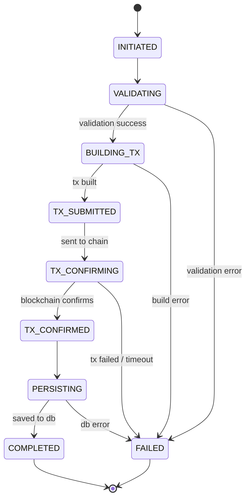

# Flow State Machine Guide

## Table of Contents
- [Overview](#overview)
- [Core Concepts](#core-concepts)
- [Architecture](#architecture)
- [Flow Types](#flow-types)
- [State Transitions](#state-transitions)
- [Idempotency](#idempotency)
- [Recovery & Checkpoints](#recovery--checkpoints)
- [Error Handling](#error-handling)
- [Integration Guide](#integration-guide)
- [Testing Flows](#testing-flows)
- [Monitoring & Debugging](#monitoring--debugging)

## Overview

The Flow State Machine is a comprehensive system for managing long-running, multi-step transaction flows with explicit states, idempotency guarantees, recovery mechanisms, and automatic cleanup. It replaces ad-hoc transaction management with a structured, observable, and resilient approach.

### Why Flow State Machines?

**Before:**
```typescript
// ❌ Problems: No idempotency, hard to recover, unclear state
const signature = await adapter.submitTransaction(tx);
await db.insert(pendingTransactions).values({ signature });
await jobQueue.enqueue(JOB_TX_CONFIRM, { signature });
// What if this crashes? What if user retries? How to resume?
```

**After:**
```typescript
// ✅ Benefits: Idempotent, recoverable, explicit state
const flow = await startCreatePositionFlow(params);
const result = await flow.run();
// Automatic deduplication, recovery from any point, full observability
```

### Key Benefits

1. **Idempotency**: Duplicate requests resume existing flows instead of creating duplicates
2. **Recovery**: Flows can resume from checkpoints after failures or crashes
3. **Observability**: Every state transition is logged and traceable
4. **Cleanup**: Stale flows are automatically detected and cleaned up
5. **Consistency**: All flows follow the same patterns and guarantees
6. **Testability**: State machines can be tested in isolation

## Core Concepts

### Flow

A **Flow** represents a long-running process that moves through well-defined states. Examples:
- Creating a liquidity position (CREATE_POSITION)
- Claiming fees (CLAIM_FEES)
- Closing a position (CLOSE_POSITION)
- Rebalancing (REBALANCE)

### State

A **State** represents a point in the flow's lifecycle. States are explicit and named:
- `INITIATED` - Flow has started
- `VALIDATING` - Input validation in progress
- `BUILDING_TX` - Building blockchain transaction
- `TX_SUBMITTED` - Transaction sent to blockchain
- `TX_CONFIRMING` - Awaiting blockchain confirmation
- `TX_CONFIRMED` - Transaction confirmed
- `PERSISTING` - Saving data to database
- `COMPLETED` - Flow successfully completed
- `FAILED` - Flow failed and cannot proceed

### Event

An **Event** triggers a state transition. Events can be:
- **Synchronous**: Returned immediately by state handlers
- **Asynchronous**: Triggered by external systems (e.g., blockchain confirmation)

Common events:
- `START` - Begin flow
- `VALIDATE_SUCCESS` - Validation passed
- `TX_SUBMITTED` - Transaction sent
- `TX_CONFIRMED` - Transaction confirmed
- `FAIL` - Operation failed
- `TIMEOUT` - Flow exceeded time limit

### Checkpoint

A **Checkpoint** stores all context needed to resume a flow from its current state. Checkpoints include:
- Current state
- All accumulated data (signatures, addresses, amounts)
- Retry counts
- Error history
- Timestamps

### Idempotency Key

An **Idempotency Key** uniquely identifies a user's intent. Format:
```
{FLOW_TYPE}:{USER_ID}:{INTENT}
```

Examples:
- `CREATE_POSITION:user123:pool_SOL-USDC`
- `CLAIM_FEES:user456:position_abc123`
- `CLOSE_POSITION:user789:position_def456`

## Architecture

### Component Overview

```
┌─────────────────────────────────────────────────────────────┐
│                      Use Case Layer                         │
│              (CreatePositionUseCase, etc.)                  │
│                          │                                   │
│                          ▼                                   │
│              startCreatePositionFlow()                      │
└──────────────────────────┬──────────────────────────────────┘
                           │
                           ▼
┌─────────────────────────────────────────────────────────────┐
│                   FlowService                               │
│  • Creates flows with idempotency keys                      │
│  • Triggers state transitions                               │
│  • Manages checkpoints                                      │
└──────────────────────────┬──────────────────────────────────┘
                           │
                           ▼
┌─────────────────────────────────────────────────────────────┐
│                 FlowStateMachine                            │
│  • Executes state handlers                                  │
│  • Manages state transitions                                │
│  • Handles errors and retries                               │
└──────────────────────────┬──────────────────────────────────┘
                           │
                           ▼
┌─────────────────────────────────────────────────────────────┐
│                    Flow Workers                             │
│  • FlowRunnerWorker: Execute steps                          │
│  • FlowCleanupWorker: Cleanup stale flows                   │
│  • FlowRecoveryWorker: Recover failed flows                 │
└──────────────────────────┬──────────────────────────────────┘
                           │
                           ▼
┌─────────────────────────────────────────────────────────────┐
│                 FlowRepository                              │
│  • Persists flows to pending_transactions table             │
│  • Queries flow state                                       │
│  • Updates checkpoints                                      │
└─────────────────────────────────────────────────────────────┘
```

### Database Schema

Flows are stored in the `pending_transactions` table with these columns:

| Column | Type | Purpose |
|--------|------|---------|
| `id` | UUID | Primary key |
| `idempotency_key` | TEXT | Unique flow identifier |
| `flow_state` | TEXT | Current state (e.g., "TX_CONFIRMING") |
| `flow_status` | TEXT | High-level status (PENDING, PROCESSING, COMPLETED, FAILED) |
| `flow_checkpoint` | JSONB | Recovery context |
| `flow_started_at` | TIMESTAMP | Flow creation time |
| `flow_last_transition_at` | TIMESTAMP | Last state change |
| `flow_completed_at` | TIMESTAMP | Completion/failure time |
| `flow_expires_at` | TIMESTAMP | Stale threshold |
| `flow_timeout_ms` | INTEGER | Max flow duration |

## Flow Types

### CREATE_POSITION Flow

Creates a new liquidity position.

**States:**
1. `INITIATED` - Flow started
2. `VALIDATING` - Validating inputs (wallet, pool, amounts)
3. `BUILDING_TX` - Building transaction instructions
4. `TX_SUBMITTED` - Transaction sent to blockchain
5. `TX_CONFIRMING` - Awaiting confirmation (async wait)
6. `TX_CONFIRMED` - Transaction confirmed
7. `PERSISTING` - Saving position to database
8. `COMPLETED` - Position created successfully

**Context:**
```typescript
interface CreatePositionContext {
  userId: string;
  walletAddress: string;
  poolAddress: string;
  dex: string;
  tokenA: Token;
  tokenB: Token;
  tokenAAmount: string;
  tokenBAmount: string;
  strategy: string;
  
  // Accumulated during flow
  positionAddress?: string;
  signature?: string;
  blockHeight?: number;
}
```

**Example:**
```typescript
const flow = await startCreatePositionFlow({
  userId: user.id,
  walletAddress: user.walletAddress,
  poolAddress: pool.address,
  dex: 'meteora',
  tokenA: { address: 'SOL...', symbol: 'SOL' },
  tokenB: { address: 'USDC...', symbol: 'USDC' },
  tokenAAmount: '1000000000', // 1 SOL in lamports
  tokenBAmount: '100000000', // 100 USDC in smallest unit
  strategy: 'SPOT',
});

// Flow starts running automatically
// Returns immediately with flow ID
return { flowId: flow.flowId, status: 'INITIATED' };
```

### CLAIM_FEES Flow

Claims accumulated fees from a position.

**States:**
1. `INITIATED`
2. `VALIDATING`
3. `BUILDING_TX`
4. `TX_SUBMITTED`
5. `TX_CONFIRMING` (async)
6. `TX_CONFIRMED`
7. `SWAP_PENDING` (if auto-convert to SOL) (async)
8. `SWAP_COMPLETED`
9. `PERSISTING`
10. `COMPLETED`

**Conditional Paths:**
- If fees are already in SOL: Skip swap states
- If auto-convert enabled: Execute swap after claim

### CLOSE_POSITION Flow

Closes a position and claims all fees.

**States:**
1. `INITIATED`
2. `VALIDATING`
3. `CLOSING_POSITION` - Build close transaction
4. `CLOSE_TX_SUBMITTED`
5. `CLOSE_TX_CONFIRMING` (async)
6. `CLOSE_TX_CONFIRMED`
7. `CLAIMING_FEES` - Build claim transaction
8. `CLAIM_TX_SUBMITTED`
9. `CLAIM_TX_CONFIRMING` (async)
10. `CLAIM_TX_CONFIRMED`
11. `PERSISTING`
12. `COMPLETED`

**Multi-Transaction:**
Close flow handles two transactions atomically:
1. Close position
2. Claim remaining fees

### REBALANCE Flow

Closes old position and creates new position with updated range.

**States:**
1. `INITIATED`
2. `VALIDATING`
3. `CLOSING_OLD` - Close existing position
4. `CLOSE_TX_CONFIRMING` (async)
5. `CLOSE_TX_CONFIRMED`
6. `CALCULATING_NEW_RANGE` - Determine new price range
7. `CREATING_NEW` - Create new position
8. `CREATE_TX_CONFIRMING` (async)
9. `CREATE_TX_CONFIRMED`
10. `PERSISTING`
11. `COMPLETED`

**Multi-Step Coordination:**
Rebalance orchestrates close + create as a single flow.

## State Transitions

### Synchronous Transitions

Handler returns next state immediately:

```typescript
{
  name: "validate",
  state: CreatePositionState.VALIDATING,
  handler: async (context) => {
    // Validate inputs
    if (!context.walletAddress) {
      return {
        success: false,
        error: "Wallet address required",
        state: CreatePositionState.FAILED
      };
    }
    
    if (context.tokenAAmount <= 0) {
      return {
        success: false,
        error: "Amount must be positive",
        state: CreatePositionState.FAILED
      };
    }
    
    // Validation passed, move to next state
    return {
      success: true,
      state: CreatePositionState.BUILDING_TX
    };
  }
}
```

### Asynchronous Transitions

Some states wait for external events:

```typescript
{
  name: "confirm_transaction",
  state: CreatePositionState.TX_CONFIRMING,
  handler: async (context) => {
    // This handler does NOT advance immediately
    // It waits for external trigger
    return {
      success: true,
      state: CreatePositionState.TX_CONFIRMING,
      asyncWait: true // Flag: don't auto-advance
    };
  }
}
```

External system triggers transition:

```typescript
// In TransactionConfirmWorker after confirmation
await flowService.trigger(flowId, FlowEvent.TX_CONFIRMED, {
  signature: confirmedSignature,
  blockHeight: blockHeight
});
```

### Transition Diagram



## Idempotency

### How It Works

1. User initiates action (e.g., create position in SOL-USDC pool)
2. System generates idempotency key: `CREATE_POSITION:user123:pool_SOL-USDC`
3. Check if flow with this key already exists:
   - **If exists and NOT completed**: Resume existing flow
   - **If exists and completed**: Return completed flow
   - **If NOT exists**: Create new flow

### Code Example

```typescript
async function startCreatePositionFlow(params: CreatePositionParams) {
  // Generate idempotency key
  const idempotencyKey = `CREATE_POSITION:${params.userId}:${params.poolAddress}`;
  
  // Check for existing flow
  const existingFlow = await flowRepository.findByIdempotencyKey(idempotencyKey);
  
  if (existingFlow) {
    if (existingFlow.status === 'COMPLETED') {
      // Already completed, return result
      return existingFlow;
    } else {
      // In progress, resume
      logger.info({ idempotencyKey }, 'Resuming existing flow');
      return existingFlow;
    }
  }
  
  // Create new flow
  const flow = await flowRepository.create({
    idempotencyKey,
    flowType: 'CREATE_POSITION',
    context: params,
    timeout: 600000, // 10 minutes
  });
  
  // Start execution
  await jobQueue.enqueue(JOB_FLOW_RUNNER, { flowId: flow.id });
  
  return flow;
}
```

### User Experience

**Scenario 1: Duplicate Click**
- User clicks "Create Position" button
- User clicks again immediately (double-click)
- System: Detects existing flow, resumes instead of creating duplicate
- Result: Only one position created ✅

**Scenario 2: Network Error**
- User submits transaction
- Network fails before confirmation
- User retries
- System: Resumes from TX_CONFIRMING state
- Result: Same transaction monitored, no duplicate ✅

**Scenario 3: App Crash**
- Flow is in TX_CONFIRMING state
- Server crashes
- Server restarts
- FlowRunnerWorker picks up flow
- System: Resumes checking transaction
- Result: Transaction completes successfully ✅

## Recovery & Checkpoints

### Checkpoint Structure

Every state transition saves a checkpoint:

```typescript
{
  currentState: "TX_CONFIRMING",
  
  // All context needed to resume
  context: {
    userId: "user123",
    walletAddress: "ABC...",
    poolAddress: "DEF...",
    tokenAAmount: "1000000000",
    positionAddress: "GHI...",
    signature: "JKL...",
  },
  
  // Execution metadata
  retryCount: 1,
  maxRetries: 3,
  lastAttemptAt: "2025-01-15T10:30:00Z",
  
  // Error history
  errors: [
    {
      state: "TX_SUBMITTED",
      event: "FAIL",
      error: "RPC timeout",
      timestamp: "2025-01-15T10:29:00Z",
      retryable: true,
    }
  ],
  
  // Additional data
  estimatedGas: "5000",
  simulationResult: {...},
}
```

### Recovery Strategies

#### 1. Automatic Retry

For transient errors (network issues, RPC timeouts):

```typescript
if (error.isTransient && flow.retryCount < flow.maxRetries) {
  // Increment retry count
  await flowRepository.updateCheckpoint(flowId, {
    retryCount: flow.retryCount + 1,
    lastAttemptAt: new Date(),
    errors: [...flow.errors, newError],
  });
  
  // Re-enqueue with exponential backoff
  const delay = Math.pow(2, flow.retryCount) * 1000; // 2s, 4s, 8s
  await jobQueue.enqueue(JOB_FLOW_RUNNER, { flowId }, { delay });
}
```

#### 2. Compensation

For partially completed flows that need rollback:

```typescript
async function compensateCreatePosition(flow: Flow) {
  const { positionAddress, signature } = flow.checkpoint.context;
  
  if (positionAddress && signature) {
    // Position was created but persistence failed
    // Attempt to close position
    await closePosition(positionAddress);
    logger.info({ flowId: flow.id }, 'Compensation: Closed created position');
  }
  
  await flowRepository.markAsFailed(flow.id, 'Compensated and rolled back');
}
```

#### 3. Manual Recovery

For complex failures requiring human intervention:

```typescript
async function triggerManualRecovery(flowId: string) {
  const flow = await flowRepository.findById(flowId);
  
  // Mark for manual review
  await flowRepository.update(flowId, {
    status: 'REQUIRES_MANUAL_REVIEW',
    tags: ['manual_recovery_needed'],
  });
  
  // Notify support team
  await alertService.notify({
    severity: 'HIGH',
    message: `Flow ${flowId} requires manual recovery`,
    context: flow.checkpoint,
  });
}
```

### Resume from Checkpoint

```typescript
async function resumeFlow(flowId: string) {
  const flow = await flowRepository.findById(flowId);
  
  // Restore context from checkpoint
  const context = flow.checkpoint.context;
  const currentState = flow.checkpoint.currentState;
  
  // Create state machine with restored state
  const machine = new FlowStateMachine(flow.definition, context);
  machine.setState(currentState);
  
  // Continue execution from current state
  const result = await machine.run();
  
  return result;
}
```

## Error Handling

### Error Classification

Errors are classified for appropriate handling:

```typescript
enum ErrorType {
  USER_ERROR = 'USER_ERROR',         // User input issue
  TRANSIENT_ERROR = 'TRANSIENT_ERROR', // Temporary, retry
  SYSTEM_ERROR = 'SYSTEM_ERROR',     // Internal failure
  BLOCKCHAIN_ERROR = 'BLOCKCHAIN_ERROR', // On-chain issue
}
```

### Error Handling Strategy

```typescript
async function handleFlowError(flow: Flow, error: Error) {
  const errorType = classifyError(error);
  
  switch (errorType) {
    case ErrorType.USER_ERROR:
      // User error: Fail immediately with clear message
      await flowRepository.markAsFailed(flow.id, error.message);
      await notifyUser(flow.userId, {
        title: 'Action Failed',
        message: error.message,
        action: 'Please check your inputs and try again',
      });
      break;
      
    case ErrorType.TRANSIENT_ERROR:
      // Transient: Retry with backoff
      if (flow.retryCount < flow.maxRetries) {
        await retryFlow(flow);
      } else {
        await flowRepository.markAsFailed(flow.id, 'Max retries exceeded');
        await notifyUser(flow.userId, {
          title: 'Action Failed',
          message: 'Service temporarily unavailable. Please try again later.',
        });
      }
      break;
      
    case ErrorType.BLOCKCHAIN_ERROR:
      // Blockchain: Parse and surface actionable info
      const blockchainError = parseBlockchainError(error);
      await flowRepository.markAsFailed(flow.id, blockchainError.message);
      await notifyUser(flow.userId, {
        title: 'Transaction Failed',
        message: blockchainError.userMessage,
        txSignature: blockchainError.signature,
      });
      break;
      
    case ErrorType.SYSTEM_ERROR:
      // System: Log, alert, attempt recovery
      logger.error({ error, flowId: flow.id }, 'System error in flow');
      await alertService.notify({
        severity: 'CRITICAL',
        message: 'Flow system error',
        context: { flowId: flow.id, error },
      });
      await attemptRecovery(flow);
      break;
  }
}
```

### Error Context

Errors are enriched with context:

```typescript
class FlowError extends Error {
  constructor(
    message: string,
    public code: string,
    public type: ErrorType,
    public retryable: boolean,
    public context: Record<string, any>
  ) {
    super(message);
  }
}

// Usage
throw new FlowError(
  'Insufficient balance for transaction',
  'INSUFFICIENT_BALANCE',
  ErrorType.USER_ERROR,
  false, // Not retryable
  {
    required: '1.5 SOL',
    available: '0.8 SOL',
    shortfall: '0.7 SOL',
  }
);
```

## Integration Guide

### Step 1: Define Flow States

```typescript
// src/services/flows/my-flow-types.ts
export enum MyFlowState {
  INITIATED = 'INITIATED',
  PROCESSING = 'PROCESSING',
  COMPLETED = 'COMPLETED',
  FAILED = 'FAILED',
}

export interface MyFlowContext {
  userId: string;
  inputData: string;
  // ... other fields
}
```

### Step 2: Define Flow Definition

```typescript
// src/services/flows/my-flow.ts
import { FlowDefinition, FlowStep } from './flow-types';

export const myFlowDefinition: FlowDefinition<MyFlowContext, MyFlowState> = {
  name: 'MY_FLOW',
  initialState: MyFlowState.INITIATED,
  
  steps: [
    {
      name: 'process',
      state: MyFlowState.PROCESSING,
      handler: async (context) => {
        // Your logic here
        const result = await doSomething(context.inputData);
        
        return {
          success: true,
          state: MyFlowState.COMPLETED,
          data: { result },
        };
      },
      timeout: 30000, // 30 seconds
      maxRetries: 3,
    },
  ],
  
  timeout: 300000, // 5 minutes total
};
```

### Step 3: Create Starter Function

```typescript
// src/services/flows/my-flow.ts
export async function startMyFlow(params: MyFlowContext) {
  const idempotencyKey = `MY_FLOW:${params.userId}:${params.inputData}`;
  
  const flowService = new FlowService();
  const flow = await flowService.start(
    myFlowDefinition,
    params,
    idempotencyKey
  );
  
  return flow;
}
```

### Step 4: Use in Use Case

```typescript
// src/application/my-feature/my-use-case.ts
export class MyUseCase {
  async execute(params: MyUseCaseParams) {
    try {
      const flow = await startMyFlow({
        userId: params.userId,
        inputData: params.data,
      });
      
      return {
        success: true,
        flowId: flow.id,
        status: flow.status,
      };
    } catch (error) {
      logger.error({ error }, 'Failed to start flow');
      throw error;
    }
  }
}
```

### Step 5: Handle External Events

```typescript
// src/infrastructure/jobs/workers/my-worker.ts
export class MyWorker {
  async process(job: Job) {
    const { flowId, eventData } = job.data;
    
    const flowService = new FlowService();
    
    // Trigger transition
    await flowService.trigger(flowId, FlowEvent.CUSTOM_EVENT, eventData);
  }
}
```

## Testing Flows

### Unit Testing State Handlers

```typescript
// __tests__/flows/my-flow.test.ts
import { describe, it, expect } from 'vitest';
import { myFlowDefinition } from '@/services/flows/my-flow';

describe('MyFlow', () => {
  it('should transition from INITIATED to PROCESSING', async () => {
    const handler = myFlowDefinition.steps[0].handler;
    
    const result = await handler({
      userId: 'test-user',
      inputData: 'test-data',
    });
    
    expect(result.success).toBe(true);
    expect(result.state).toBe(MyFlowState.COMPLETED);
  });
  
  it('should handle errors gracefully', async () => {
    const handler = myFlowDefinition.steps[0].handler;
    
    const result = await handler({
      userId: 'test-user',
      inputData: '', // Invalid input
    });
    
    expect(result.success).toBe(false);
    expect(result.state).toBe(MyFlowState.FAILED);
    expect(result.error).toBeDefined();
  });
});
```

### Integration Testing Flows

```typescript
// __tests__/integration/my-flow-integration.test.ts
import { describe, it, expect, beforeEach } from 'vitest';
import { startMyFlow } from '@/services/flows/my-flow';
import { FlowRepository } from '@/services/flows/flow-state-machine';

describe('MyFlow Integration', () => {
  let flowRepository: FlowRepository;
  
  beforeEach(async () => {
    flowRepository = new FlowRepository();
    await cleanupTestFlows();
  });
  
  it('should complete flow end-to-end', async () => {
    const flow = await startMyFlow({
      userId: 'test-user',
      inputData: 'test-data',
    });
    
    // Wait for completion
    await waitForFlowCompletion(flow.id, 30000);
    
    const completedFlow = await flowRepository.findById(flow.id);
    expect(completedFlow.status).toBe('COMPLETED');
  });
  
  it('should be idempotent', async () => {
    const params = {
      userId: 'test-user',
      inputData: 'test-data',
    };
    
    const flow1 = await startMyFlow(params);
    const flow2 = await startMyFlow(params);
    
    // Should be same flow
    expect(flow1.id).toBe(flow2.id);
  });
  
  it('should recover from failure', async () => {
    const flow = await startMyFlow({
      userId: 'test-user',
      inputData: 'test-data',
    });
    
    // Simulate failure
    await flowRepository.update(flow.id, {
      status: 'FAILED',
      checkpoint: {
        ...flow.checkpoint,
        retryCount: 1,
      },
    });
    
    // Trigger recovery
    await flowService.recover(flow.id);
    
    // Wait for completion
    await waitForFlowCompletion(flow.id, 30000);
    
    const recoveredFlow = await flowRepository.findById(flow.id);
    expect(recoveredFlow.status).toBe('COMPLETED');
  });
});
```

### Testing Recovery Scenarios

```typescript
it('should resume from checkpoint after crash', async () => {
  // Start flow
  const flow = await startMyFlow(params);
  
  // Wait until specific state
  await waitForFlowState(flow.id, MyFlowState.PROCESSING);
  
  // Simulate crash (stop workers)
  await stopWorkers();
  
  // Restart workers
  await startWorkers();
  
  // Flow should resume automatically
  await waitForFlowCompletion(flow.id, 30000);
  
  const completedFlow = await flowRepository.findById(flow.id);
  expect(completedFlow.status).toBe('COMPLETED');
});
```

## Monitoring & Debugging

### Logging

Flow events are logged with structured data:

```typescript
// Flow started
logger.info({
  flowId: flow.id,
  flowType: 'CREATE_POSITION',
  userId: flow.context.userId,
  idempotencyKey: flow.idempotencyKey,
}, 'Flow started');

// State transition
logger.info({
  flowId: flow.id,
  fromState: 'BUILDING_TX',
  toState: 'TX_SUBMITTED',
  duration: 1234, // ms
}, 'Flow state transition');

// Flow completed
logger.info({
  flowId: flow.id,
  status: 'COMPLETED',
  totalDuration: 45678, // ms
  retryCount: 2,
}, 'Flow completed');

// Flow failed
logger.error({
  flowId: flow.id,
  state: 'TX_CONFIRMING',
  error: error.message,
  retryCount: 3,
  maxRetries: 3,
}, 'Flow failed');
```

### Querying Flow State

```typescript
// Get flow by ID
const flow = await flowRepository.findById(flowId);
console.log({
  status: flow.status,
  currentState: flow.checkpoint.currentState,
  startedAt: flow.startedAt,
  lastTransitionAt: flow.lastTransitionAt,
  retryCount: flow.checkpoint.retryCount,
});

// Get flows by user
const userFlows = await flowRepository.findByUserId(userId);

// Get active flows
const activeFlows = await flowRepository.findActive();

// Get stale flows
const staleFlows = await flowRepository.findStale();
```

### Metrics

Track flow metrics for monitoring:

```typescript
// Flow duration
histogram.observe({
  flowType: 'CREATE_POSITION',
  status: 'COMPLETED',
}, durationMs);

// Flow success rate
counter.inc({
  flowType: 'CREATE_POSITION',
  status: 'COMPLETED',
});

counter.inc({
  flowType: 'CREATE_POSITION',
  status: 'FAILED',
});

// Retry count
histogram.observe({
  flowType: 'CREATE_POSITION',
}, retryCount);

// Active flows gauge
gauge.set({
  flowType: 'CREATE_POSITION',
}, activeCount);
```

### Debugging Tips

**1. Find flow for a user action:**
```sql
SELECT * FROM pending_transactions
WHERE idempotency_key LIKE 'CREATE_POSITION:user123:%'
ORDER BY flow_started_at DESC
LIMIT 1;
```

**2. View checkpoint data:**
```sql
SELECT 
  id,
  flow_state,
  flow_status,
  flow_checkpoint->>'currentState' as current_state,
  flow_checkpoint->'context' as context,
  flow_checkpoint->'errors' as errors
FROM pending_transactions
WHERE id = 'flow-id';
```

**3. Find stuck flows:**
```sql
SELECT * FROM pending_transactions
WHERE flow_status IN ('PENDING', 'PROCESSING')
  AND flow_last_transition_at < NOW() - INTERVAL '10 minutes';
```

**4. View error history:**
```sql
SELECT 
  id,
  flow_state,
  jsonb_array_length(flow_checkpoint->'errors') as error_count,
  flow_checkpoint->'errors'->-1 as last_error
FROM pending_transactions
WHERE flow_status = 'FAILED';
```

### Alerts

Set up monitoring alerts:

```typescript
// High failure rate
if (failureRate > 0.1) { // >10%
  alert({
    severity: 'HIGH',
    message: `Flow failure rate: ${failureRate * 100}%`,
  });
}

// Stale flows accumulating
if (staleFlowCount > 50) {
  alert({
    severity: 'MEDIUM',
    message: `${staleFlowCount} stale flows detected`,
  });
}

// Long-running flows
if (flowDuration > 600000) { // >10 minutes
  alert({
    severity: 'LOW',
    message: `Flow ${flowId} running for ${flowDuration}ms`,
  });
}
```

## Best Practices

### 1. Keep States Explicit
- Define clear, named states
- Avoid generic states like "PROCESSING"
- Use specific states like "BUILDING_TX", "TX_CONFIRMING"

### 2. Store All Context in Checkpoints
- Include everything needed to resume
- Don't rely on external state
- Make checkpoints self-contained

### 3. Use Idempotency Keys Wisely
- Include user intent in key
- Don't include timestamps or random values
- Ensure same intent = same key

### 4. Handle Errors Appropriately
- Classify errors correctly
- Retry transient errors only
- Provide clear user messages

### 5. Set Appropriate Timeouts
- Consider blockchain confirmation times
- Add buffer for network delays
- Don't make timeouts too short

### 6. Test Recovery Scenarios
- Test resuming from each state
- Simulate crashes and failures
- Verify idempotency

### 7. Monitor Flow Health
- Track success rates
- Monitor durations
- Alert on anomalies

## Reference

- **Implementation**: `apps/bot/src/services/flows/`
- **Migration**: `apps/bot/src/db/migrations/0003_flow_state_machine.sql`
- **Workers**: `apps/bot/src/infrastructure/jobs/workers/`
- **Summary Doc**: `/FLOW_STATE_MACHINE_IMPLEMENTATION.md`

---

**Last Updated**: January 2025  
**Version**: 2.0
